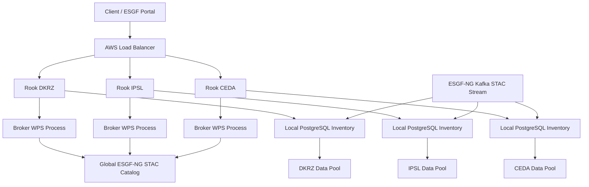
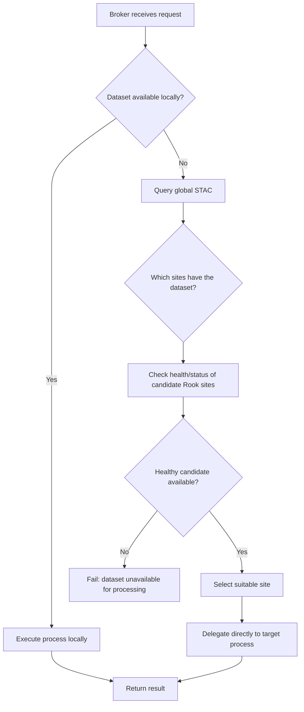

## Rook federation for ESGF-NG

Rook should remain a **single software deployment** that can serve multiple use cases such as CDS and ESGF-NG.

For ESGF-NG, each Rook site maintains a **local PostgreSQL inventory** of datasets and assets available in its local data pool. This inventory is updated from the ESGF-NG Kafka stream carrying STAC records and patches.

Normal processing requests use a **logical dataset ID**, not a list of file URLs. Rook resolves the dataset to local NetCDF files or aggregations through a generic dataset resolver.

If a dataset is missing from the local inventory, Rook may optionally query the **global ESGF-NG STAC catalog**. If STAC confirms that the dataset is available at the local site, Rook can reconstruct the local source information and optionally repair the local inventory. Remote HTTP assets should not be used silently as a fallback.

For federated processing, every Rook instance exposes the same lightweight **broker WPS process**. The public ESGF endpoint can use the existing AWS load balancer to send a request to any available Rook instance. The broker then decides whether to process the request locally or delegate it to another Rook site that has the dataset and is currently available.

Dataset placement and service health remain separate:

* **STAC** tells Rook where a dataset is available.
* **health/status processes** tell Rook which sites are currently ready for processing.
* The **broker** combines both pieces of information and selects a suitable site.

Delegated requests are sent directly to the target processing process, not to the target broker, which prevents routing loops.

### Architecture overview

### Processing flow

This keeps the architecture decentralized: there is **no dedicated central broker service**. Every Rook deployment contains the same federation logic, while the AWS load balancer only provides a stable and highly available entry point.
