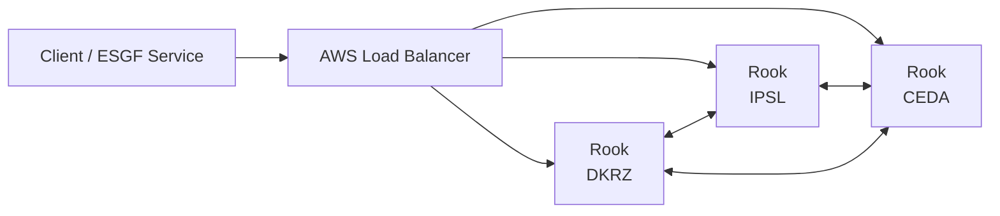
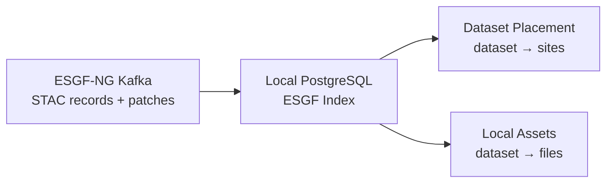
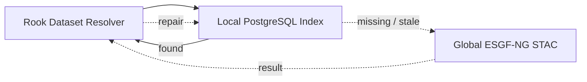
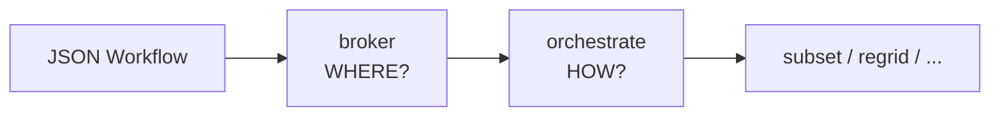
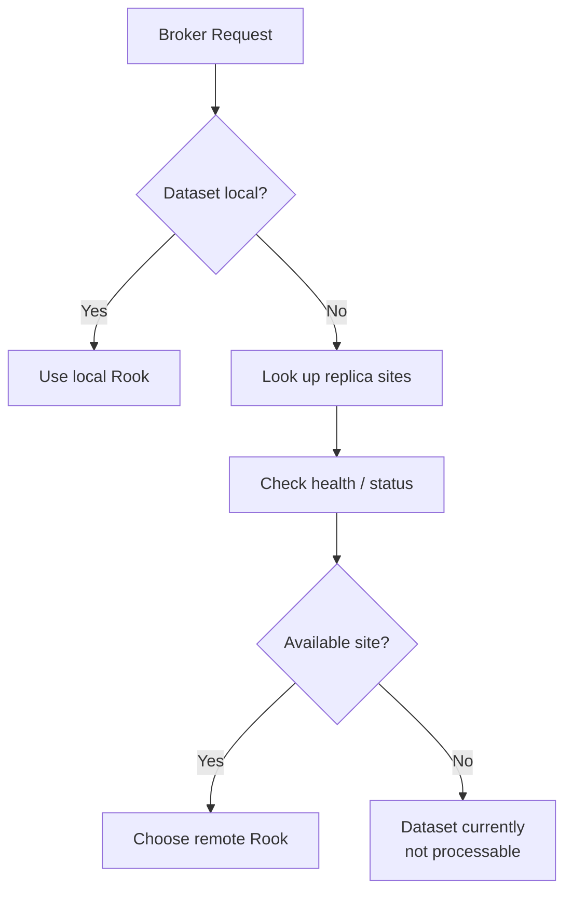
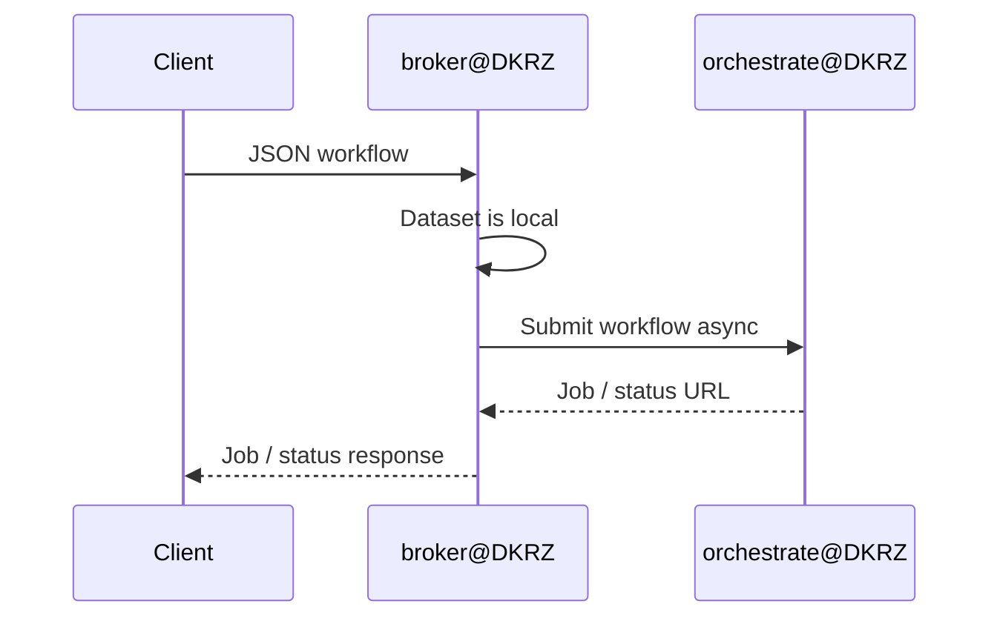
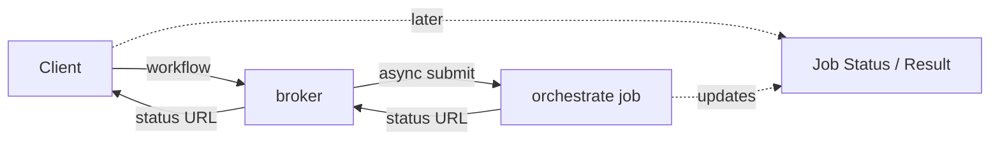

# Rook Federation for ESGF-NG

## Design idea

Rook remains **one software deployment** serving different use cases such as CDS and ESGF-NG.

For ESGF-NG:

* DKRZ, IPSL and CEDA run identical Rook services.
* Their ESGF data pools overlap, but are not identical.
* Every Rook can act as the entry point for a request.
* A lightweight `broker` WPS process chooses the appropriate Rook site.
* The existing AWS load balancer provides a stable and highly available public endpoint.
* No additional central broker service is required.

## 1. High-level architecture



The load balancer only needs to select an **available Rook**.

It does not need to know which datasets are available at which site. The selected Rook handles this through its `broker` process.

---

## 2. Dataset knowledge at every site

Each Rook site maintains a PostgreSQL index with two kinds of information:

* **global dataset placement:** which ESGF sites provide a dataset;
* **local assets:** the actual files or aggregations available to the local Rook.



The Kafka STAC stream keeps the index synchronized with ESGF-NG publication.

The broker normally uses the **local database**, rather than querying the global STAC API for every request.

---

## 3. STAC as fallback

The local index can occasionally be incomplete or out of sync.

The global ESGF-NG STAC catalog therefore provides a fallback.



* The local PostgreSQL index is the normal lookup path.
* STAC is queried when information is missing or suspected to be stale.
* Information obtained from STAC can optionally repair the local index.
* A remote HTTP asset is **not** silently used just because the local asset is missing.

---

## 4. Broker and orchestrate

The new `broker` process uses the **same parameters and JSON workflow document as `orchestrate`**.

Their responsibilities are deliberately different:



### `broker`

* inspects the workflow;
* identifies the dataset;
* determines where the dataset is available;
* chooses a suitable Rook site;
* submits `orchestrate` asynchronously at that site.

### `orchestrate`

* interprets the workflow;
* runs the requested processing;
* does not make federation/routing decisions.

In short:

> **broker decides WHERE — orchestrate decides HOW.**

---

## 5. Site selection

The broker combines **dataset placement** with the current **Rook service availability**.



STAC/index information and service health have different purposes:

* **dataset index:** where does the data exist?
* **health/status:** which of those Rook sites can currently accept work?
* **broker:** which site should execute this request?

Temporary Rook downtime does not change the dataset placement information.

---

## 6. Local execution

If the receiving Rook has the dataset locally, the broker submits the workflow to its own `orchestrate` process.



The broker itself does not perform the processing.

---

## 7. Remote execution

If the dataset is not local, the broker chooses another healthy site that provides it.


The remote call goes **directly to `orchestrate`**, not to the remote broker.

This prevents delegation loops such as:

```text
DKRZ broker → CEDA broker → IPSL broker → ...
```

---

## 8. Asynchronous jobs

The broker only needs to remain active long enough to:

1. inspect the workflow;
2. select a Rook site;
3. submit `orchestrate` asynchronously;
4. receive the accepted/running job response;
5. return it to the client.



The broker does **not** maintain a second copy of the job state.

The client receives the status information for the actual `orchestrate` job, whether that job runs locally or remotely.

---

## Summary

The federation adds only a small amount of functionality to the existing Rook architecture:

* **AWS LB** — highly available public entry point.
* **broker** — chooses the execution site.
* **orchestrate** — executes the workflow.
* **local PostgreSQL ESGF index** — fast dataset placement and local asset lookup.
* **Kafka** — keeps the local ESGF indexes synchronized.
* **global STAC** — authoritative fallback when the local index is missing or stale.
* **health/status** — identifies Rook sites currently able to accept jobs.

There is no dedicated central broker or additional cloud service. Every site runs the same Rook software and can independently receive and delegate ESGF-NG processing requests.
