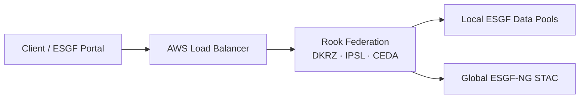
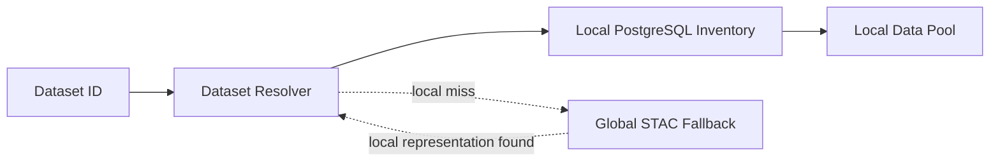
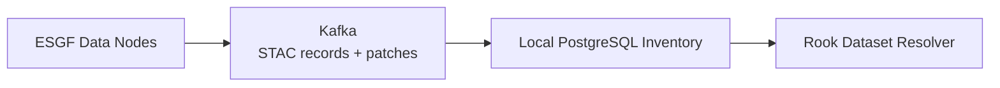
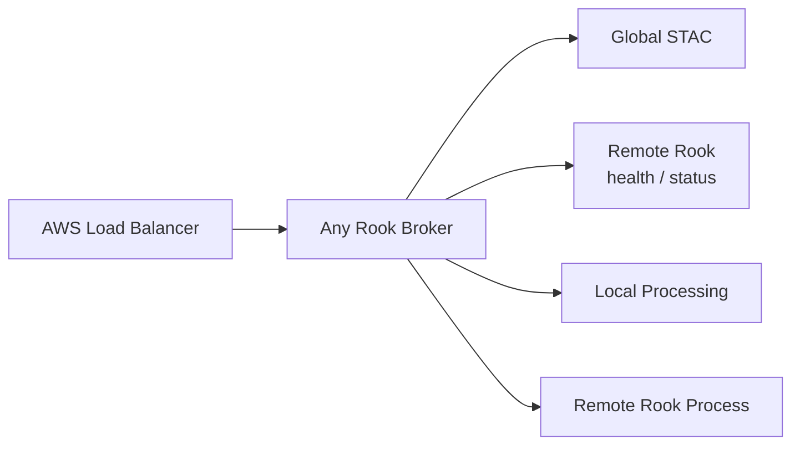
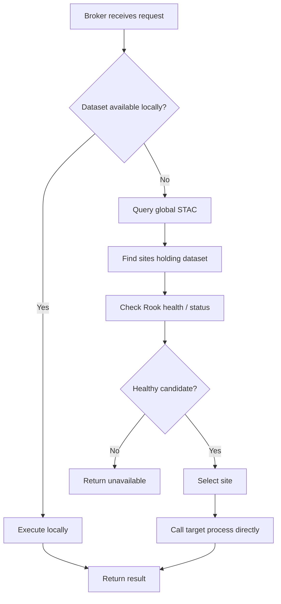

## Rook federation for ESGF-NG

Rook remains a **single software deployment** serving multiple use cases such as CDS and ESGF-NG.

For ESGF-NG, each site maintains a **local PostgreSQL inventory** of datasets and assets available in its local data pool. The inventory is updated from the ESGF-NG Kafka stream carrying STAC records and patches.

Normal processing requests use a **logical dataset ID**. Rook resolves the dataset to local NetCDF files or aggregations through a generic dataset resolver.

If the dataset is missing from the local inventory, Rook may optionally query the **global ESGF-NG STAC catalog**. If STAC confirms that the dataset is available at the local site, Rook can reconstruct the local source information and optionally repair the local inventory. Remote HTTP assets should not silently become a processing fallback.

For federation, every Rook instance exposes the same lightweight **broker WPS process**. The existing AWS load balancer can send a request to any available Rook instance. The broker then either processes locally or delegates the request to another Rook site that has the dataset and is currently available.

Dataset placement and service availability stay separate:

* **STAC** describes where datasets are available.
* **health/status processes** describe whether a Rook site is currently usable.
* The **broker** combines both and selects a suitable execution site.

Delegated requests go directly to the target processing process, not to the target broker.

## High-level overview

The AWS load balancer provides a stable entry point. The intelligence for dataset-aware routing remains inside the identical Rook deployments.

## Local dataset resolution

The local inventory is the normal resolution path. STAC is an optional fallback when the local inventory is temporarily out of sync.

## Keeping the local inventory up to date

Each Rook site maintains its own local view of the ESGF publication state.

## Federated request routing

The load balancer does not need to understand dataset placement. It only needs to deliver the request to an available Rook instance.

## Processing decision

This keeps the architecture decentralized: there is **no dedicated central broker service**. Every Rook installation contains the same resolution and federation logic, while the AWS load balancer only provides the stable public entry point.
