# Rook Federation for ESGF-NG

## What is Rook?

**Rook** is a server-side processing service for climate data.

* It provides processing operations through WPS / OGC interfaces.
* Users work with **datasets**, rather than downloading all source files first.
* Typical operations include **subset, regrid and other climate-data transformations**.
* `orchestrate` accepts a simple JSON workflow and executes the requested processing chain.
* Processing runs close to the large data pools.

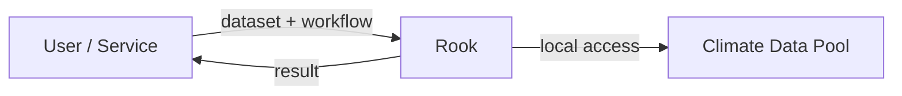

> **Move the processing to the data instead of moving the data to the user.**

**Documentation:** [Rook WPS documentation](https://rook-wps.readthedocs.io/en/latest/)

---

## Rook capabilities

Rook combines **service-level processes** with the actual **climate-data processing operators**.

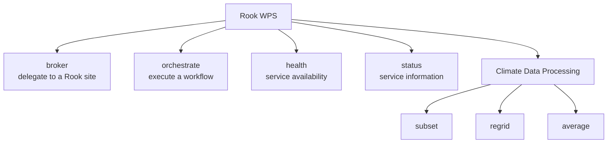

* **`broker`** — selects the Rook site and delegates the workflow.
* **`orchestrate`** — executes a JSON processing workflow.
* **`health` / `status`** — provide lightweight service and availability information.
* **`subset`, `regrid`, `average`, ...** — perform the actual climate-data processing.

This is a useful property of the WPS model: Rook can expose both **data-processing operations** and small **service functions** through the same interface.

`broker` therefore fits naturally into Rook without introducing a separate routing service.

---

# Rook for Copernicus CDS

Rook is already used to provide server-side data access and processing for the **Copernicus Climate Data Store (CDS)**.

* CDS is moving towards **Rook as the single access point** for supported datasets.
* Rook resolves CDS dataset IDs through an **Intake catalog backed by PostgreSQL**.
* DKRZ and IPSL provide equivalent data and processing capabilities.
* An AWS load balancer can therefore distribute requests between them.
* Direct CDS access to the NGINX data nodes is being phased out.
* The data nodes remain the actual storage and data-delivery layer.

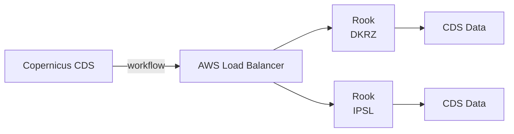

This works well because the two sites are effectively **interchangeable processing backends**.

**Links**

* [Copernicus Climate Data Store](https://cds.climate.copernicus.eu/)
* [ROOCS usage dashboard – all years](https://roocs.github.io/dashboard/summary-all-years/)

The ROOCS dashboard shows the operational use of the service over the years.

---

## Processing only when needed

Using Rook as the access point does **not** mean that every request has to generate new data.

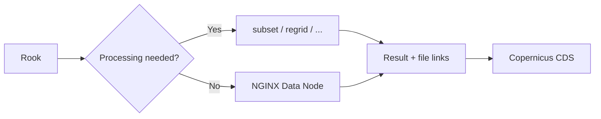

* Rook checks whether the requested data can be returned directly.
* If the requested complete NetCDF file already exists, Rook can simply return its **data-node URL**.
* Otherwise Rook performs the requested processing and returns links to the generated files.
* Currently these links are represented using a **Metalink XML response**.

Rook therefore acts as the access and processing layer while the existing data nodes remain the efficient delivery layer.

---

## Example: Rook from a notebook

Rook can also be used interactively from Python with **rooki**, the Python client for Rook.

This example uses a real C3S-CORDEX dataset and creates a small processing workflow:

```python
from rooki import operators as ops

tas = ops.Input(
    "tas",
    [
        "c3s-cordex.output.EUR-11.IPSL.IPSL-IPSL-CM5A-MR.rcp85."
        "r1i1p1.IPSL-WRF381P.v1.day.tas.v20190919"
    ],
)

subset = ops.Subset(
    tas,
    time="2006/2006",
    time_components="month:jan,feb,mar",
)

workflow = ops.Average(subset, dims="time")

response = workflow.orchestrate()
```

The workflow:

* selects a logical C3S-CORDEX dataset;
* subsets January–March 2006;
* calculates the average over time;
* sends the workflow to Rook using `orchestrate()`.

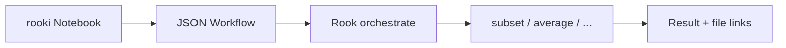

The user works with a **logical dataset ID and processing workflow**. Rook resolves and processes the underlying files close to the data.

**Complete example:** [Rendered C3S-CORDEX rooki notebook on GitHub](https://github.com/roocs/rooki/blob/master/notebooks/demo/demo-rooki-c3s-cordex.ipynb)

---

# From CDS to ESGF-NG

ESGF-NG introduces a different situation.

* DKRZ, IPSL and CEDA **independently manage their ESGF data holdings**.
* A **common core** is available at all three sites.
* Beyond this core, datasets may be available at only one or two sites.
* A normal round-robin load balancer cannot know which Rook can process a particular dataset.
* Restricting processing to the common core would unnecessarily reduce ESGF data coverage.

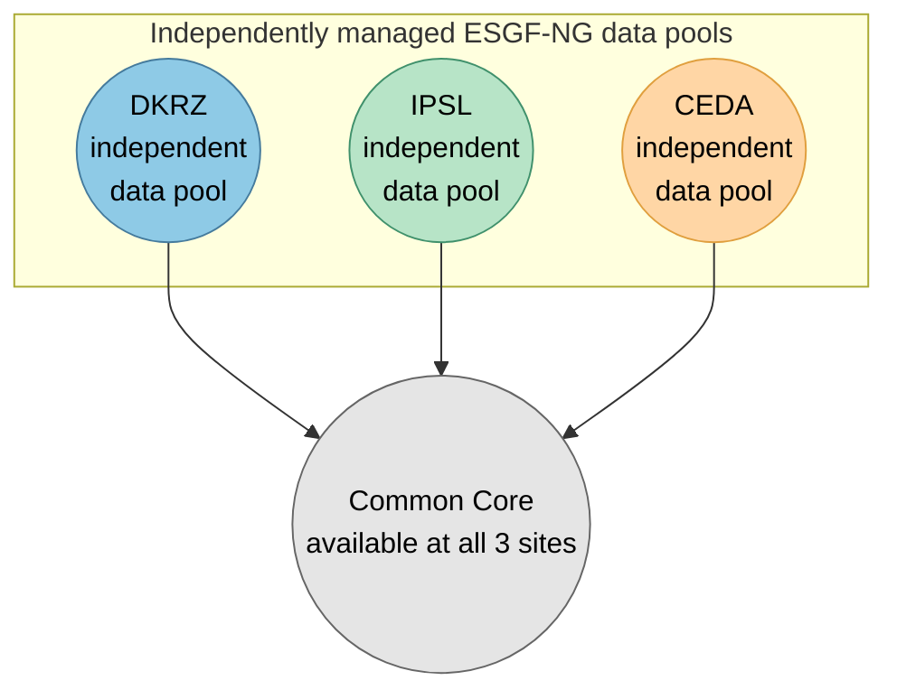

Federation allows Rook to use the **full distributed ESGF holdings**, rather than limiting processing to the common core.

The proposed solution therefore adds **dataset-aware delegation to Rook itself**.

---

# ESGF-NG Rook Federation

## Design idea

Rook remains **one software deployment** serving CDS, ESGF-NG and potentially other use cases.

For ESGF-NG:

* DKRZ, IPSL and CEDA run identical Rook services.
* Every Rook can act as the entry point for a request.
* A lightweight `broker` WPS process chooses the appropriate Rook site.
* The existing AWS load balancer provides the stable public endpoint.
* No additional central broker or cloud service is required.

---

## 1. High-level architecture

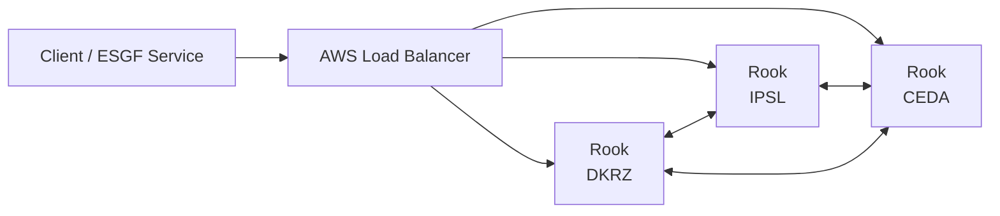

The load balancer only needs to select an **available Rook**.

It does not need to understand dataset placement. The selected Rook handles this through its `broker` process.

---

## 2. Local Rook PostgreSQL index

Each Rook site maintains its own **Rook-specific PostgreSQL database**.

This is **not** the global STAC/Elasticsearch index.

The database contains two kinds of information:

* **global dataset placement:** which ESGF sites provide a dataset;
* **local assets:** the actual files or aggregations available to the local Rook.

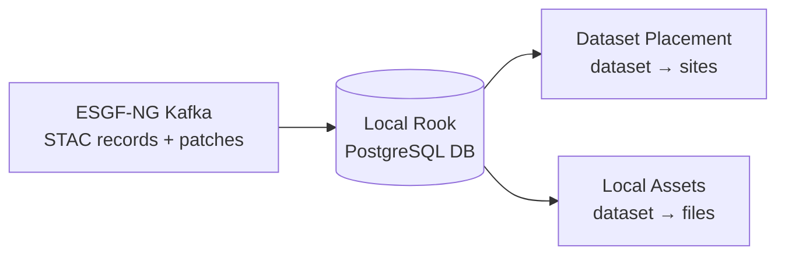

* The existing ESGF-NG Kafka publication stream keeps this local database synchronized.
* Rook therefore becomes another direct consumer of the ESGF-NG publication infrastructure.
* Each Rook has knowledge of the **global dataset placement**, while keeping detailed asset information for its own local holdings.
* Broker lookups normally use this local PostgreSQL database instead of querying the global STAC service for every request.

---

## 3. STAC as fallback

The local Rook PostgreSQL database may occasionally be incomplete or out of sync.

The global ESGF-NG STAC catalog provides a fallback.

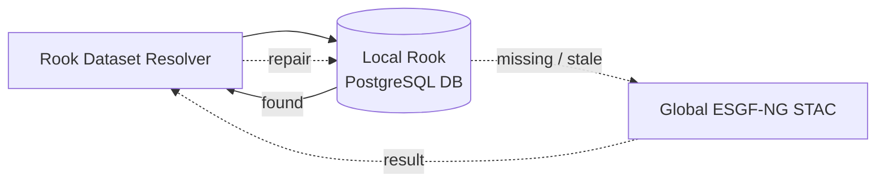

* PostgreSQL is the normal lookup path.
* STAC can recover missing information.
* Information obtained from STAC can optionally repair the local PostgreSQL database.
* Missing local data does **not** silently turn into remote HTTP processing.

---

## 4. Broker and orchestrate

`broker` uses the **same parameters and JSON workflow document as `orchestrate`**.

Their responsibilities are different:

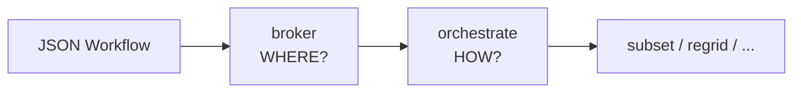

### `broker`

* inspects the workflow and identifies the dataset;
* determines where the dataset can be processed;
* selects a local or remote Rook;
* submits `orchestrate` asynchronously at the selected site.

### `orchestrate`

* interprets the workflow;
* executes `subset`, `regrid`, etc.;
* does not make federation decisions.

> **broker decides WHERE — orchestrate decides HOW.**

---

## 5. From the existing workflow to federation

The important part is that the **workflow itself does not have to change**.

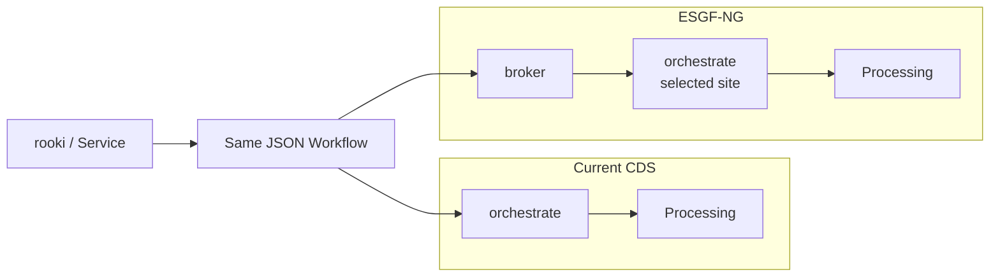

For CDS today:

```text
workflow → orchestrate
```

For federated ESGF-NG processing:

```text
same workflow → broker → orchestrate @ selected site
```

This keeps the client-facing processing model simple.

---

## 6. Site selection

The broker combines **dataset placement** with current **Rook availability**.

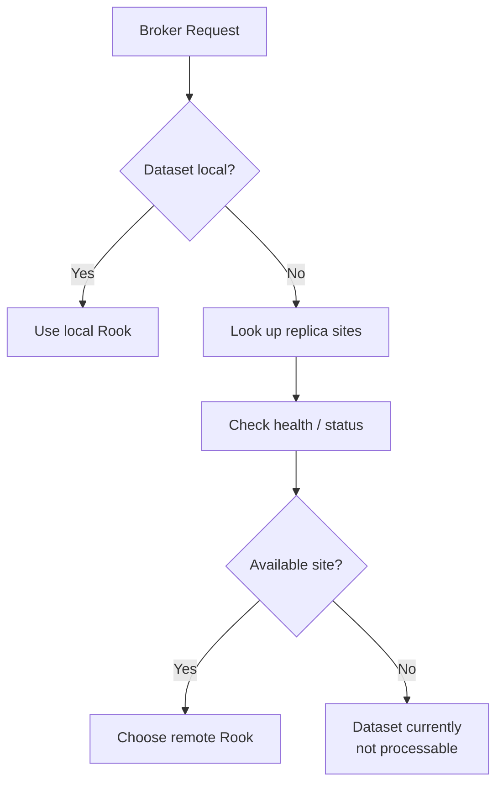

Three pieces of information have separate responsibilities:

* **Local Rook PostgreSQL DB:** where does the data exist?
* **`health` / `status`:** which Rook sites can currently accept work?
* **`broker`:** which site should execute this request?

Temporary downtime does not change the dataset placement metadata.

---

## 7. Local execution

If the receiving Rook has the dataset, the broker submits the workflow to its local `orchestrate`.

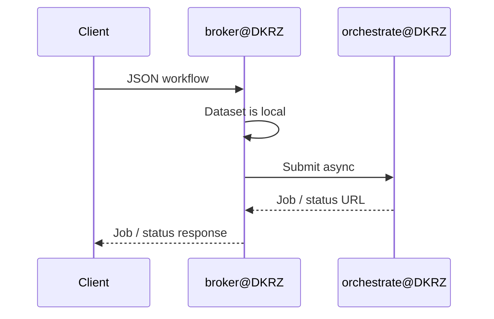

The broker performs delegation only. The actual processing remains with `orchestrate`.

---

## 8. Remote execution

If the dataset is not local, the broker selects another available site.


* The remote request goes directly to `orchestrate`.
* It does **not** call the remote broker again.
* This prevents delegation loops.

---

## 9. Asynchronous processing

The broker only participates in the initial job submission.

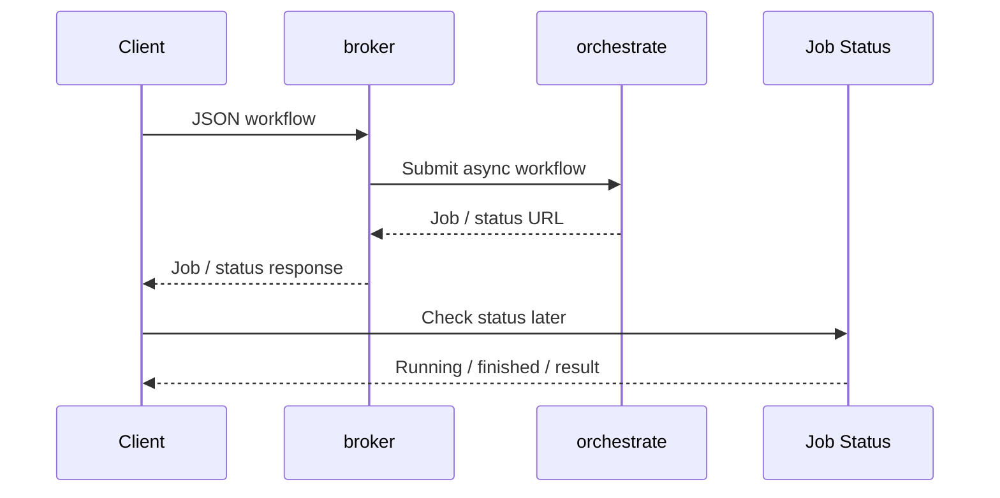

The broker:

* inspects the workflow;
* selects a site;
* submits `orchestrate`;
* returns the actual job/status response.

It does **not** maintain a second broker-side copy of the job state.

The returned status URL belongs to the real processing job, regardless of whether it runs locally or remotely.

---

# Future improvements

The federation itself can work with the **existing ESGF-NG infrastructure**. The following changes are useful improvements, but are not prerequisites for the initial implementation.

## Advertise processing in STAC

> **No STAC changes are required to implement Rook federation.**

As a future improvement, STAC could explicitly advertise that processing is supported for a dataset.

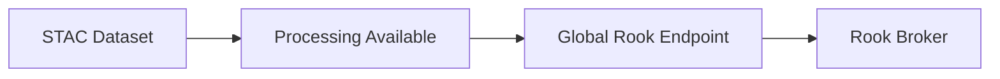

This would mainly improve **discovery and user experience**:

* An ESGF portal could immediately offer a **Process** action.
* STAC advertises processing capability, not current runtime availability.
* This is similar to advertising a data-node URL without guaranteeing that the node is currently online.
* Runtime availability remains the responsibility of Rook `health/status` and the broker.
* The global load-balanced Rook endpoint can be advertised as the ESGF processing service.

A first version could be as simple as:

```json
{
  "esgf:processing": true
}
```

Alternatively, the processing service could be advertised through an appropriate STAC service link.

The representation can later evolve into richer processing/service metadata.

> **Processing metadata in STAC is an optional discovery and UX improvement, not a requirement for Rook federation.**

---

## Modernize processing results

Rook currently returns links to processing results using a **Metalink XML document**.

Metalink works, but a future Rook version could investigate a more modern result representation.

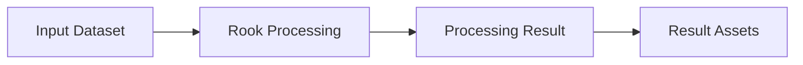

Possible improvements:

* keep the result representation simple and machine-readable;
* describe all generated files and their media types;
* support provenance and temporary output lifetime where useful;
* investigate using a **STAC Item with result assets**.

For ESGF-NG, STAC could provide an interesting common model:

```text
STAC dataset → Rook processing → STAC result
```

This is an option to investigate rather than a requirement for federation.

---

# Complete proposed solution

The complete design combines existing ESGF-NG infrastructure with identical Rook deployments at the three processing sites.

CEDA is shown in detail as an example. DKRZ and IPSL use the same Rook, local PostgreSQL database, data-node and data-pool pattern.

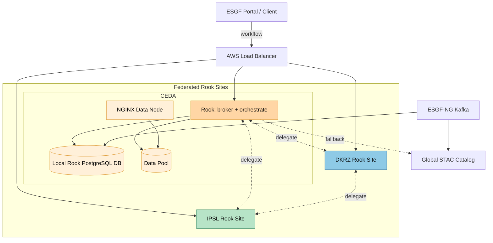

The **Local Rook PostgreSQL DB** is a Rook-specific materialized view populated from the Kafka publication stream. It is **not** the global STAC/Elasticsearch index.

The main components are:

* **AWS Load Balancer** — provides one highly available processing entry point.
* **Rook broker** — decides which site should execute the workflow.
* **Rook orchestrate** — performs the requested workflow at the selected site.
* **Local Rook PostgreSQL DB** — provides fast dataset-placement and local-asset lookup.
* **Kafka** — keeps the local Rook databases synchronized with ESGF-NG publication.
* **Global STAC catalog** — remains the global reference and fallback.
* **NGINX data nodes** — continue to provide efficient delivery of existing data.
* **Independent data pools** — can overlap without having to be identical.

> **One processing entry point, distributed data, processing close to the data.**
