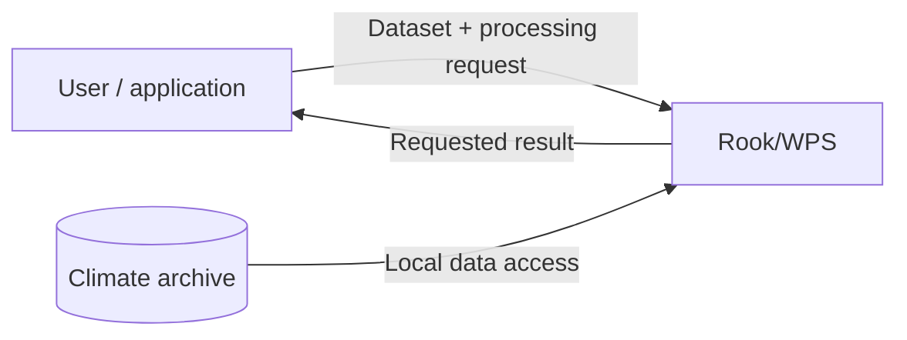
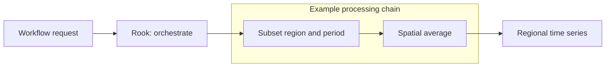
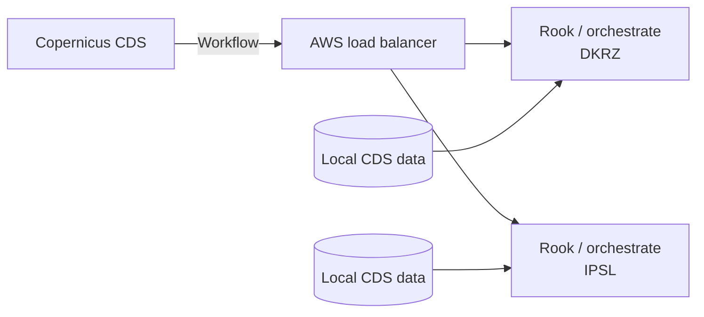
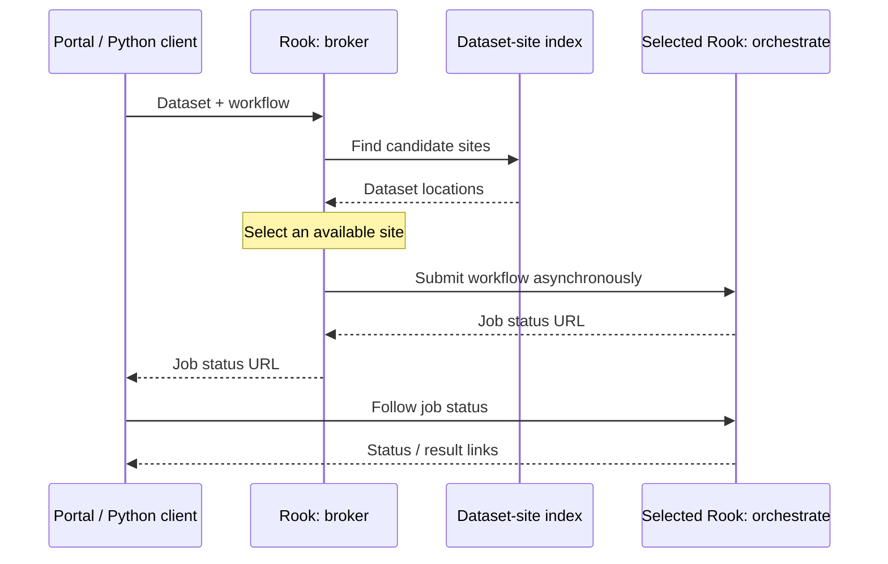
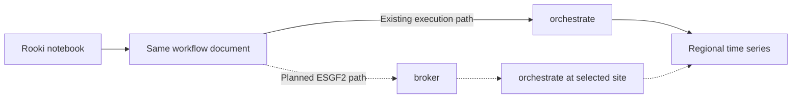
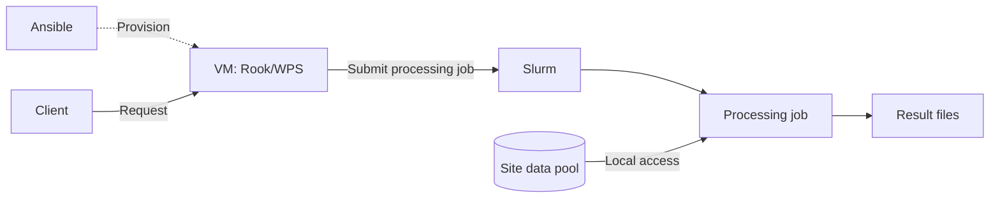
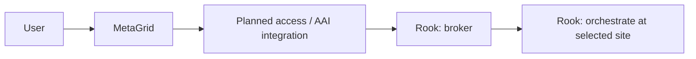

# Rook/WPS for ESGF2 — Draft

Processing climate data close to the archive

## Talk outline — 10 minutes

| Slide | Topic | Time |
| --- | --- | --- |
| 1 | Why provide a Compute Node? | 1:00 |
| 2 | Processing capabilities | 1:00 |
| 3 | Rook in the Copernicus CDS | 1:15 |
| 4 | Planned ESGF2 broker | 1:45 |
| 5 | One workflow: notebook demonstration | 2:00 |
| 6 | Deployment today | 1:00 |
| 7 | ESGF2 integration and next steps | 2:00 |

The horizontal rules below separate slides. Notes in HTML comments are presenter guidance, not slide text. Timings assume questions follow the talk.

---

## 1. Why provide a Compute Node?

**Example question: How does regional mean temperature change over time?**

- Select the region and time period needed for the analysis.
- Process data close to the archive.
- Retrieve the resulting time series.
- Reduce data transfers and integrate processing into scientific workflows.

<!-- 1:00. Introduce Rook as a managed remote processing service. WPS means Web Processing Service. The Compute Node provides another access route for ESGF2 users, including the intended CMIP7 use case. Avoid implying complete CMIP7 coverage today. -->

---

## 2. Processing capabilities

- **Subset:** select space, time and levels.
- **Average:** reduce or aggregate data for the analysis.
- **Regrid:** transform data to a target grid.
- **Workflow orchestration:** combine operations with `orchestrate`.
- **Woodpecker:** apply configured fixes for known dataset issues.

<!-- 1:00. Rook exposes processing through WPS; clisops provides the core processing operations. Mention Woodpecker so the audience recognizes the name, without explaining its plugin architecture. -->

---

## 3. Rook in the Copernicus CDS

**Existing architecture for supported CDS datasets**

- CDS submits processing workflows to Rook.
- DKRZ and IPSL provide equivalent data and processing capabilities.
- A load balancer distributes requests between these sites.
- Each site processes its local data and provides results.

<!-- 1:15. Based on the current CDS architecture described in ARCH_ESGF2.md. Equivalent holdings make these sites interchangeable for supported requests. ESGF2 requires routing that accounts for different dataset holdings. This is a simplified request/data-access view; result delivery is omitted for clarity. -->

---

## 4. Planned ESGF2 broker

**Select a site that can process the requested dataset**

- Add a `broker` process to Rook.
- Use dataset placement and service availability to select a site.
- Submit the same workflow to that site's `orchestrate` process.
- Return the processing job's status URL to the client.

<!-- 1:45. Proposed architecture, not an implemented broker demonstration. The selected Rook can be local or remote. Delegation goes directly to orchestrate, avoiding broker-to-broker loops. The broker does not maintain a second copy of job state. The design proposes a local PostgreSQL dataset-site index updated from ESGF2 publication events, with STAC as fallback; omit these details unless asked. -->

---

## 5. One workflow: notebook demonstration

**Regional mean temperature over a selected period**

- Select a dataset, region and time range.
- Build a **subset → average** workflow with the Rooki Python client.
- Submit, follow job status and retrieve the result.
- Plot the regional time series.

<!-- 2:00. Use one verified dataset and the same region/period throughout the architecture explanation and demonstration. Show the existing direct orchestrate call, its completed result and a plot. Explain that the proposed broker accepts the same workflow document; do not imply the notebook already executes through the broker. Prepare a completed notebook as a fallback. Choose the actual dataset and averaging options before rehearsal. -->

---

## 6. Deployment today

- **Ansible** provisions the service on **VMs**.
- **Slurm** schedules processing jobs.
- Processing runs against data available at the site.
- DKRZ and CEDA provide the service infrastructure.

<!-- 1:00. Describe the current operational deployment. Docker/Kubernetes/Helm are an alternative deployment path to prepare during the project, not the current production architecture. -->

---

## 7. ESGF2 integration and next steps

- **MetaGrid:** expose processing through the portal; WPS can sit behind it.
- **Broker:** route workflows to sites with the required data.
- **AAI:** build on previous proxy solutions and define access patterns.
- **CMIP7:** validate datasets and representative workflows.
- **Deployment:** prepare Docker/Kubernetes/Helm as an alternative.

**Rook complements other access methods when users need a subset or a processed result.**

<!-- 2:00. All portal/broker/AAI integration shown here is proposed. Brief AAI wording: Previous deployments used an OAuth2 proxy with Keycloak. CEDA developed an Nginx/Python proxy; Twitcher provides another foundation with OGC awareness, service registration, OAuth2 and certificate support. Twitcher is used by Ouranos, outside this ESGF2 project. Updating or rewriting components and deciding user/service delegation patterns remain future work; no proxy selection is implied. Authentication integration should therefore not be described as starting from scratch. STAC service links can support discovery where available. Close by inviting representative CMIP7 workflows for testing. -->

<!-- Preparation references (not additional slides):
- Local broker/CDS design: ARCH_ESGF2.md
- Process catalogue: docs/source/processes.rst
- Woodpecker configuration: docs/source/configuration.rst
- Deployment status and AAI history: presenter-provided context
- Twitcher: https://github.com/bird-house/twitcher/blob/master/README.rst
-->
