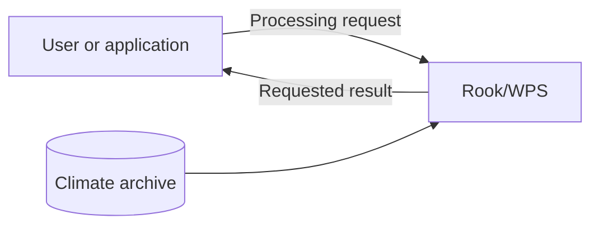
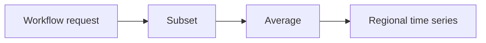
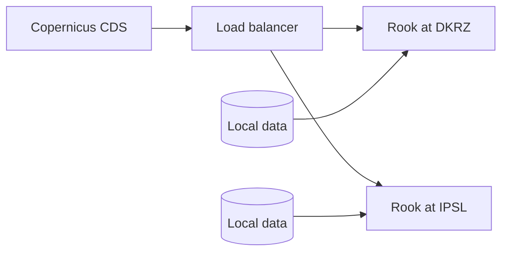
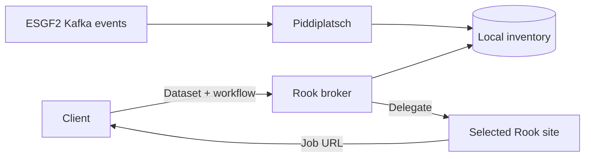
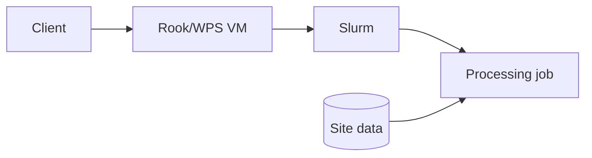
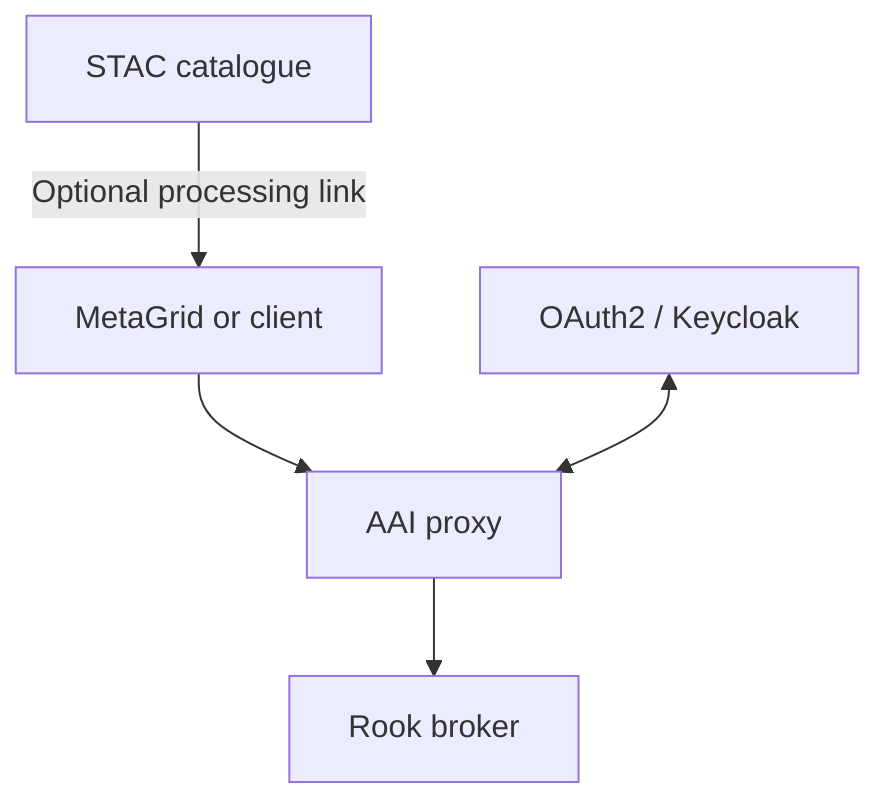
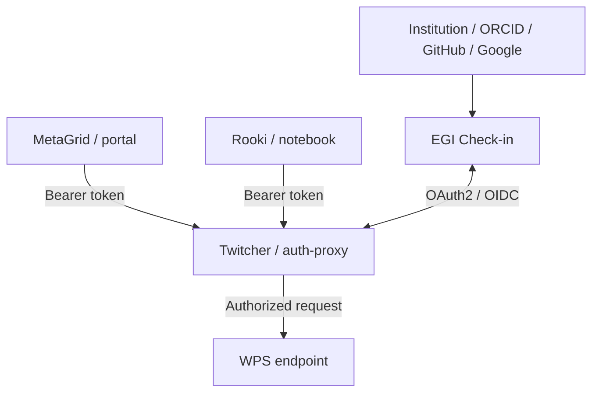
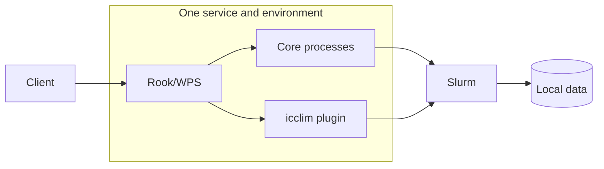
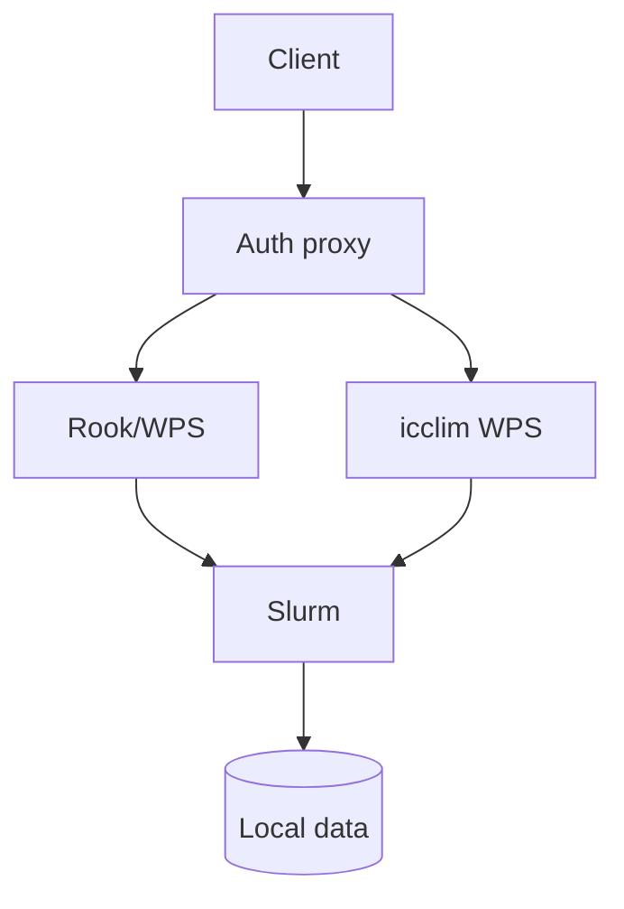
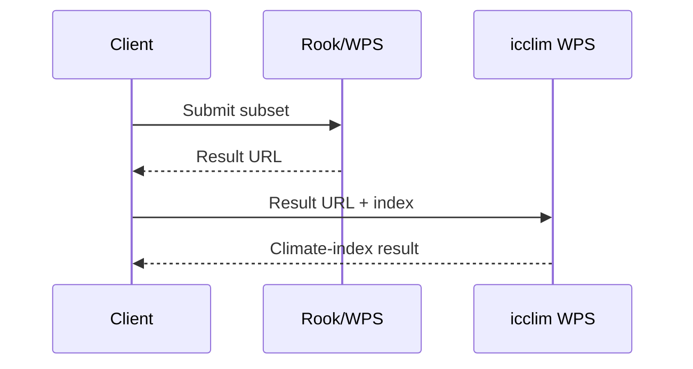

# Rook/WPS for ESGF2

Processing climate data close to the archive

## Talk outline — 10 minutes

| Slide | Topic | Time |
| --- | --- | ---: |
| 1 | Why provide a Compute Node? | 1:00 |
| 2 | Processing capabilities | 1:00 |
| 3 | Rook in the Copernicus CDS today | 1:15 |
| 4 | Planned ESGF2 broker | 2:00 |
| 5 | Notebook: today and proposed broker | 2:00 |
| 6 | Deployment today | 1:00 |
| 7 | Discovery, AAI and next steps | 1:45 |

The horizontal rules separate slides. HTML comments contain presenter notes.

---

## 1. Why provide a Compute Node?

**Example: How does regional mean temperature change over time?**

- Select only the region and period needed.
- Process the data close to the archive.
- Retrieve the small, usable result.
- Integrate processing into scientific workflows and applications.



<!-- 1:00. A Compute Node is an additional access route for ESGF users. It
complements file download: users can still retrieve complete files when that is
what they need. Avoid implying complete CMIP7 coverage today. -->

---

## 2. Processing capabilities

- **Subset:** select space, time and levels.
- **Average:** reduce data for an analysis.
- **Regrid:** transform data to a target grid.
- **Orchestrate:** combine operations in one workflow.
- **Woodpecker:** apply known fixes to datasets with compliance issues.



<!-- 1:00. Rook exposes the processing API; clisops provides the main data
operations. Mention Woodpecker by name and purpose so that people recognize it.
Do not explain its internal architecture. -->

---

## 3. Rook in the Copernicus CDS today

**Operational today**

- CDS submits workflows to Rook.
- DKRZ and IPSL provide equivalent data and processing.
- A load balancer distributes requests between the sites.
- Each site processes its local data.



<!-- 1:15. This is the existing model for supported CDS datasets. Equivalent
holdings make both sites interchangeable. ESGF2 needs smarter routing because
participating sites will not necessarily hold the same datasets. -->

---

## 4. Planned ESGF2 broker

**Route processing to a site that holds the requested dataset**

- Add a `broker` process to Rook.
- Accept the same workflow document used by `orchestrate`.
- Select a site using dataset placement and service availability.
- Submit the processing job asynchronously.
- Return the selected site's job-status URL directly.



<!-- 2:00. Planned architecture. Kafka publication, update and deletion events
keep a local PostgreSQL inventory current through a Piddiplatsch plugin. Kafka
is not part of the synchronous request path. The selected site may run a single
process or an orchestrated workflow. The broker is only a delegation layer: it
does not mirror remote job state and must not create broker-to-broker loops. -->

---

## 5. Notebook: today and proposed broker

**Current implementation — executable with Rooki**

```python
from rooki.client import Rooki

rook = Rooki("https://rook.dkrz.de/wps", mode="async")

response = rook.subset(
    collection=(
        "c3s-cmip6.CMIP.IPSL.IPSL-CM6A-LR.historical."
        "r1i1p1f1.Amon.rlds.gr.v20180803"
    ),
    time="1985-01-01/2014-12-30",
    area="-10,35,30,70",
)

response.ok
response.download_urls()
dataset = response.datasets()[0]
```

**Proposed ESGF2 broker — same user intent, automatic site selection**

```python
workflow = {
    "process": "subset",
    "inputs": {
        "collection": "<same-dataset-id>",
        "time": "1985-01-01/2014-12-30",
        "area": "-10,35,30,70",
    },
}

job = rook.broker(workflow=workflow)  # proposed API
job.status_url
```

**Today the client selects the service. The broker will select the site.**

<!-- 2:00. Run only the first example. It uses the dataset from the documented
Rooki example; verify the endpoint and dataset before the talk and prepare the
completed result as a fallback. response.download_urls() and response.datasets() are part
of the current Rooki interface. The broker call is deliberately labelled as a
proposed API sketch. Its exact Python signature is not implemented or fixed yet.
For a multi-step subset/average example, pass an orchestrate-style workflow
document instead; the architectural point remains the same. -->

---

## 6. Deployment today

**Current operational deployment**

- **Ansible** provisions Rook/WPS on **VMs**.
- **Slurm** schedules processing jobs.
- Jobs access data available at the site.
- The same model can be deployed at further ESGF2 sites.



<!-- 1:00. Describe only the current deployment. Docker, Kubernetes and Helm
are an alternative deployment path to prepare during ESGF2, not the present
production architecture. -->

---

## 7. Discovery, AAI and next steps

- **STAC:** optionally advertise processing with a small flag or service link.
- **Portal:** MetaGrid or another client discovers the endpoint through STAC.
- **AAI proxy:** protect Rook and delegate identity with OAuth2/Keycloak.
- **Next:** validate CMIP7 workflows and prepare a container deployment.



**STAC provides discovery. AAI protects access. Rook provides processing.**

<!-- 1:45. Rook's integration boundary is the processing API and optional STAC
information. Portal integration belongs to MetaGrid or its successor. A small
processing indicator or service link is sufficient and can be added later via
an ESGF2 Kafka update; do not propose an exact STAC schema in this talk.

AAI is a required layer between clients and the processing services, especially
when a portal acts on behalf of a user. It does not start from scratch. Earlier
deployments used an AAI proxy with OAuth2 delegation to Keycloak. CEDA developed
an Nginx/Python proxy. Twitcher offers more OGC-aware functionality, including
service registration, OAuth2 and certificate support, and is actively used by
Ouranos in Canada. ESGF2 still needs to review these components and define the
required user-to-service and service-to-service delegation patterns. Do not
imply that a proxy has already been selected. -->

<!-- Preparation references:

- Local broker/CDS design: ARCH_ESGF2.md
- Process catalogue: docs/source/processes.rst
- Woodpecker configuration: docs/source/configuration.rst
- Twitcher: https://github.com/bird-house/twitcher/blob/master/README.rst
-->

---

## 8. AAI for the ESGF2 Compute Node with EGI

* Users sign in through **EGI Check-in** using institutional accounts, **ORCID, GitHub, Google**, or other identity providers.
* MetaGrid and Rooki send an OAuth2 **bearer token** with each request.
* **Twitcher/auth-proxy** validates the token, authorizes access and handles delegation.
* The **WPS endpoint remains independent of the AAI implementation**.



**EGI provides identity and entitlements; the proxy protects WPS.**

---

## 9. Option 1 — icclim as a Rook plugin

* `rook-icclim` is maintained in a separate repository.
* Python entry points register one generic `climate_indices` process.
* Sites choose either **core** or **core + icclim** requirements.
* All processes run in the same conda environment.



**Simple integration, provided the dependencies remain compatible.**

<!-- Toulouse maintains the plugin and its scientific implementation. Compute
sites decide whether to install it. A locked combined environment must be
tested against existing Rook/CDS workflows. -->

---

## 9. Option 2 — Separate icclim WPS

* Rook and icclim use independent conda environments.
* Both services run next to the data and use the local Slurm cluster.
* Existing Ansible support for multiple WPS instances can be reused.
* Dependencies and release cycles remain isolated.



**More deployment work, but stronger isolation and independent ownership.**

<!-- Toulouse can maintain the complete icclim WPS. The service is deployed at
CEDA, DKRZ or another data site; calculations do not need to run in Toulouse. -->

---

## 9. Option 2 — Chaining both services

* Rook first creates the required spatial and temporal subset.
* Its output URL becomes the input of the icclim process.
* At the same site, trusted output URLs can map directly to local files.
* The client coordinates both jobs initially.
* Server-side workflow orchestration can be added later.



**Separate services, but the intermediate data remains at the Compute Node.**

<!-- URL-to-path translation must accept only configured local output prefixes.
A later workflow/orchestrate process could coordinate both asynchronous jobs
and expose one composite job to the client. -->
