# Rook/WPS for ESGF2

## Smart access to climate data

[](https://commons.wikimedia.org/wiki/File:Rook-Corvus_frugilegus.jpg)

**Rook — Remote Operations On Klimadaten**

*Like the bird: surveys vast archives, finds what matters, and brings it within easy reach.*

Milano, 2026

*Photo: Andreas Trepte, [Wikimedia Commons](https://commons.wikimedia.org/wiki/File:Rook-Corvus_frugilegus.jpg), [CC BY-SA 2.5](https://creativecommons.org/licenses/by-sa/2.5/).*

<!-- EDITORIAL NOTE FOR SLIDE PREPARATION

- Proposed main talk: title slide plus slides 1–8, about ten minutes.
- Optional backup material: A1 and B1–B3.
- `wf.broker()` is a proposed API sketch, not an implemented interface.
- Docker, Kubernetes and Helm are future deployment options, not operational today.
- Horizontal rules separate slides; other HTML comments are presenter notes.
-->

---

# 1. What is Rook?

- [**Rook**](https://github.com/roocs/rook) is a remote processing service from the roocs project.
- Clients use **logical datasets and workflows**.
- Processing runs **close to the data** and returns only the **requested result**.

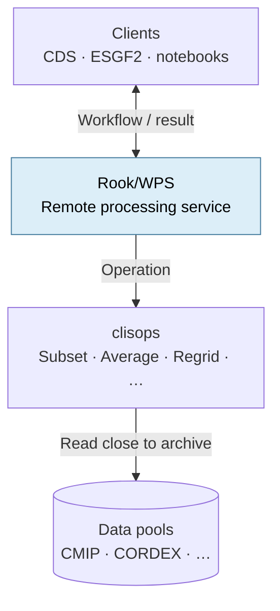

**Move the processing to the data.**

<!-- 1:00. Rook connects climate-data clients with Python processing based on
xarray and clisops. It complements file download: users can still retrieve
complete files when that is what they need. Avoid implying complete CMIP7
coverage today. -->

---

# 2. Processing capabilities

- **Subset:** select space, time and levels.
- **Average:** reduce data for an analysis.
- **Regrid:** transform data to a target grid.
- **Orchestrate:** combine operations in one workflow.
- [**Woodpecker**](https://github.com/roocs/woodpecker): apply known fixes through a common plugin interface.

[**clisops**](https://github.com/roocs/clisops) provides the core data operations.

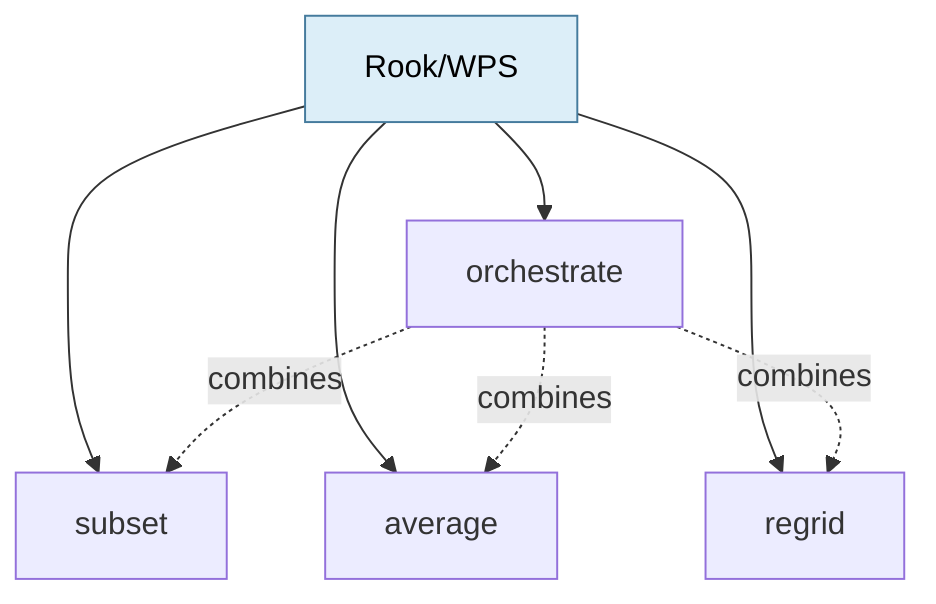

**Woodpecker prepares the data. Rook operates on it.**

<!-- 1:00. Rook exposes the processing API; clisops provides the main data
operations. Woodpecker discovers and applies maintained dataset fixes through
its core and independent plugins. Keep its internal architecture for the
separate Woodpecker talk. -->

---

# 3. Rook in the Copernicus CDS today

**Operational today**

- **One access point** for CDS workflows.
- **Identical Rook installations** at DKRZ and IPSL.
- **Equivalent processing and replicated CMIP6, CORDEX, and other supported data** at both sites.
- The **load balancer can choose any available Rook**.
- Rook executes the workflow **close to the data**.

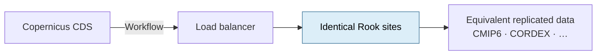

**CDS: choose any available Rook.**

<!-- 1:15. This is the existing model for supported CDS datasets. Equivalent
holdings make both sites interchangeable. ESGF2 needs smarter routing because
participating sites will not necessarily hold the same datasets. -->

---

# 4. Planned ESGF2 broker

**Route the same workflow to a site that holds the requested dataset**

- **NEW: `broker`** decides where the workflow runs.
- **NEW: local PostgreSQL index** provides fast dataset-to-site lookup.
- **REUSE:** Kafka and [**Piddiplatsch**](https://github.com/ESGF/piddiplatsch) keep the local index synchronized.
- **FALLBACK: global STAC** supplies missing or stale placement information.
- ESGF2 data pools remain **independently managed and different**.

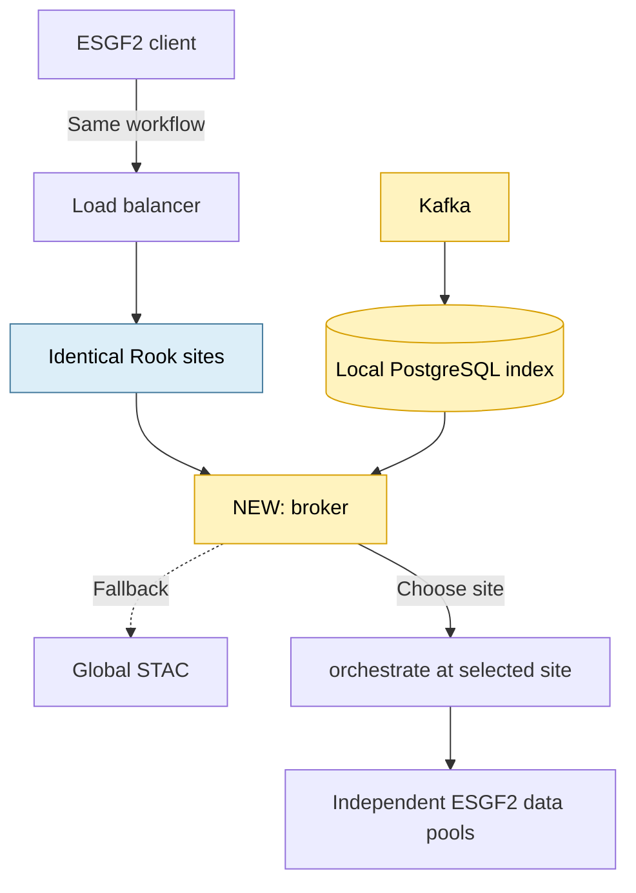

**ESGF2: choose the Rook that has the data.**

**Details:** [ESGF2 broker architecture](https://github.com/roocs/rook/blob/add-milan-presentation/ARCH_ESGF2.md)

<!-- 2:00. Planned architecture. Kafka publication, update and deletion events
keep the local PostgreSQL index current through a Piddiplatsch plugin. The index
contains global dataset placement and detailed local assets. Global STAC is the
authoritative fallback when local information is missing or stale. Kafka and
STAC are not part of the normal synchronous request path.

The broker does not change or execute the workflow. It forwards the same
workflow to the selected Rook site's `orchestrate` process and passes the
accepted-job response and status URL back to the client. It does not mirror
remote job state and must not create broker-to-broker loops. -->

---

# 5. Notebook: today and proposed broker

**Define the workflow once with Rooki**

```python
from rooki import operators as ops

wf = ops.Subset(
    ops.Input(
        "tas",
        [
            "c3s-cmip6.ScenarioMIP.INM.INM-CM5-0.ssp245."
            "r1i1p1f1.day.tas.gr1.v20190619"
        ],
    ),
    time="2016/2020",
    time_components="month:jan,feb,mar|day:01",
)
```

**Today — send the workflow to `orchestrate` at a chosen Rook service**

```python
resp = wf.orchestrate()
resp.ok
```

**Proposed — send the same workflow to `broker`**

```python
resp = wf.broker()  # proposed API
resp.ok
```

**Same workflow: `broker` decides WHERE — `orchestrate` decides HOW.**

<!-- 2:00. The workflow construction and wf.orchestrate() call come from the
existing notebook. Verify the endpoint and dataset before the talk and prepare
the completed result as a fallback.

wf.broker() is deliberately labelled as a proposed API sketch; its exact
Python signature is not implemented or fixed yet. Both calls serialize the
same workflow document. Orchestrate executes it at the service selected by the
client. Broker inspects it to resolve the dataset location, forwards it
unchanged to the selected Rook site, and returns that site's job-status URL. -->

---

# 6. Deployment today and tomorrow

- **Today:** Ansible provisions Rook/WPS on **VMs**.
- **Today:** Slurm schedules processing jobs close to site data.
- **Next:** build one **portable Rook container image**.
- **Future:** deploy with **Docker or Kubernetes**, depending on the site.
- The **Rook API and processing model stay the same**.

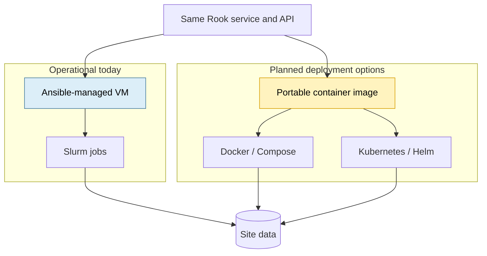

**One service, multiple deployment models.**

<!-- 1:00. The Ansible/VM/Slurm path is operational today. The container image,
Docker, Kubernetes and a possible Helm chart are future ESGF2 work. They should
not require a different client API or processing implementation. A site may
keep Slurm or choose a container-native scheduler. -->

---

# 7. Discovery, AAI and next steps

- **STAC:** advertise processing with a **small flag or service link**.
- **Portal:** MetaGrid or another client **discovers the endpoint through STAC**.
- **AAI:** use an **OAuth2 security proxy** with **EGI Check-in or Keycloak**, supporting institutional, **GitHub, Google, and ORCID** identities.
- **Demo:** use the maintained [**Twitcher**](https://github.com/bird-house/twitcher); later review or rewrite the proxy for ESGF2.
- **Next:** validate **CMIP7 workflows**.

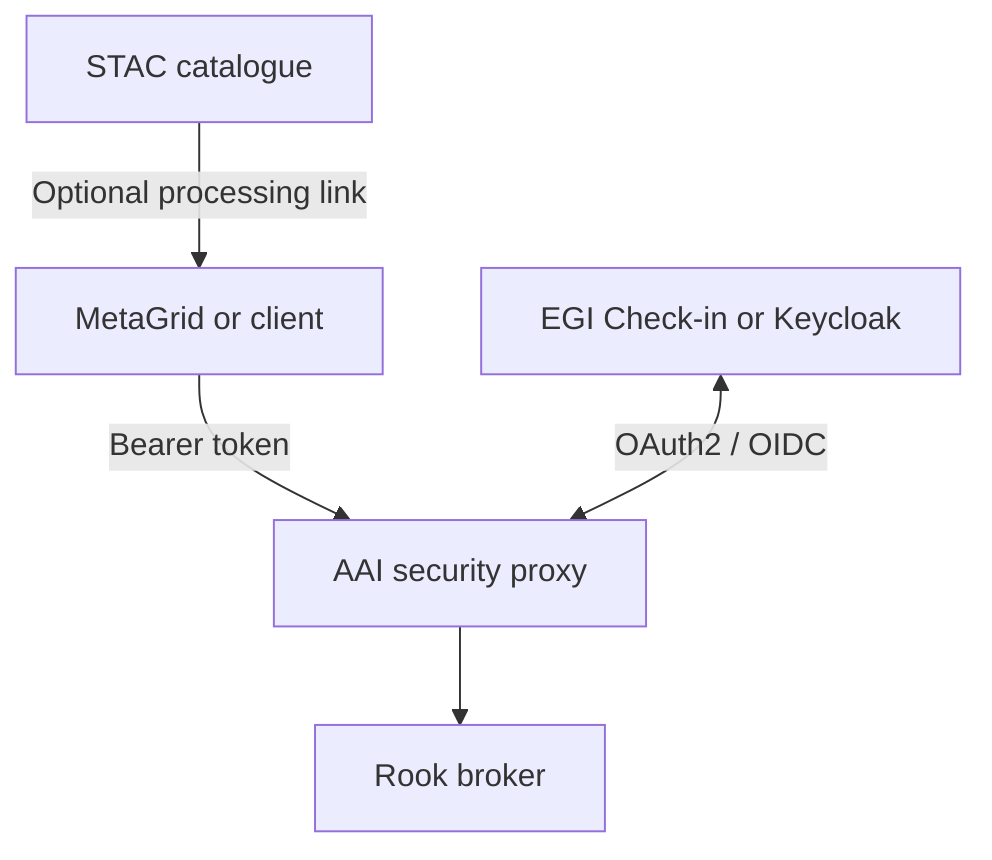

**STAC provides discovery. AAI protects access. Rook provides processing.**

<!-- 1:45. Rook's integration boundary is the processing API and optional STAC
information. Portal integration belongs to MetaGrid or its successor. A small
processing indicator or service link is sufficient and can be added later via
an ESGF2 Kafka update; do not propose an exact STAC schema in this talk.

Twitcher is an existing, maintained component and is used by Ouranos in Canada.
It supports an immediate ESGF2 demonstration. ESGF2 may later rewrite or
replace the security proxy according to its final user-to-service and
service-to-service delegation requirements. Keep the WPS API independent of
the selected proxy implementation. -->

<!-- Preparation references:

- Detailed broker architecture: https://github.com/roocs/rook/blob/add-milan-presentation/ARCH_ESGF2.md
- Process catalogue: docs/source/processes.rst
- Woodpecker configuration: docs/source/configuration.rst
- Twitcher: https://github.com/bird-house/twitcher/blob/master/README.rst
-->

---

# 8. Summary: today and tomorrow

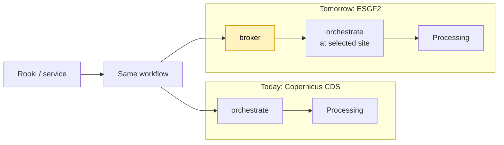

- **Same Rook**, processing operations, and workflow model.
- **CDS:** choose any equivalent Rook.
- **ESGF2:** choose the Rook that has the data.
- Processing remains **close to the archive**.

**`broker` decides WHERE — `orchestrate` decides HOW.**

<!-- 0:30. This is the closing picture. The ESGF2 extension adds data-aware
site selection without changing the workflow or the processing operations. -->

---

# A1. AAI for the ESGF2 Compute Node

## Existing components support an immediate demonstration

- Users sign in through **EGI Check-in or Keycloak**.
- Supported identities can include institutional accounts, **GitHub, Google, and ORCID**.
- MetaGrid and Rooki send an OAuth2 **bearer token** with each request.
- **Twitcher** validates the token, authorizes access, and protects the WPS endpoint.
- Twitcher is maintained and currently used by **Ouranos in Canada**.
- ESGF2 can use **Twitcher for a demonstration** while designing a future security proxy.
- The **processing API remains independent** of the proxy implementation.

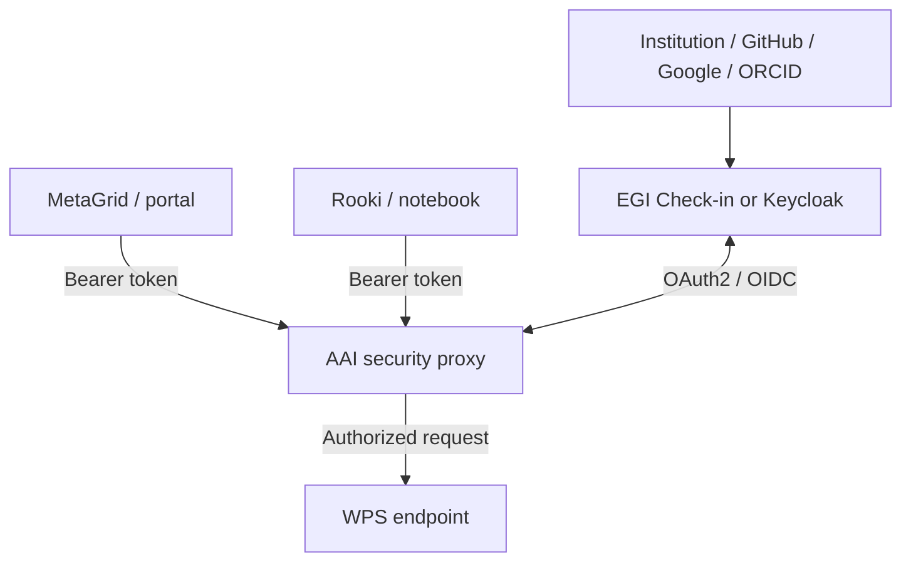

**Use Twitcher now; keep the proxy replaceable for the final ESGF2 architecture.**

---

# B1. Option 1 — icclim as a Rook plugin

- A separate Rook plugin exposes [**icclim**](https://github.com/cerfacs-globc/icclim).
- **Python entry points** register one generic `climate_indices` process.
- Sites choose either **core** or **core + icclim** requirements.
- All processes run in the **same conda environment**.

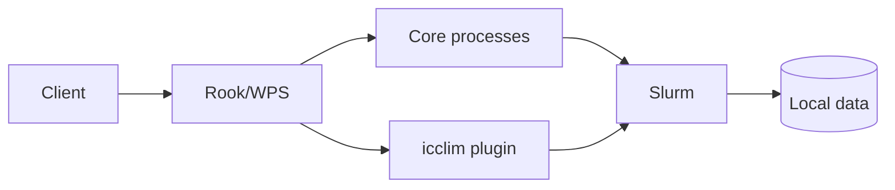

**Simple integration, provided the dependencies remain compatible.**

---

# B2. Option 2 — Separate icclim WPS

- Rook and icclim use **independent conda environments**.
- Both services run **next to the data** and use the **local Slurm cluster**.
- The **Rook broker** selects the service providing the requested process.
- Its inventory contains **dataset locations** and **available processing capabilities**.
- Existing Ansible support for **multiple WPS instances** can be reused.

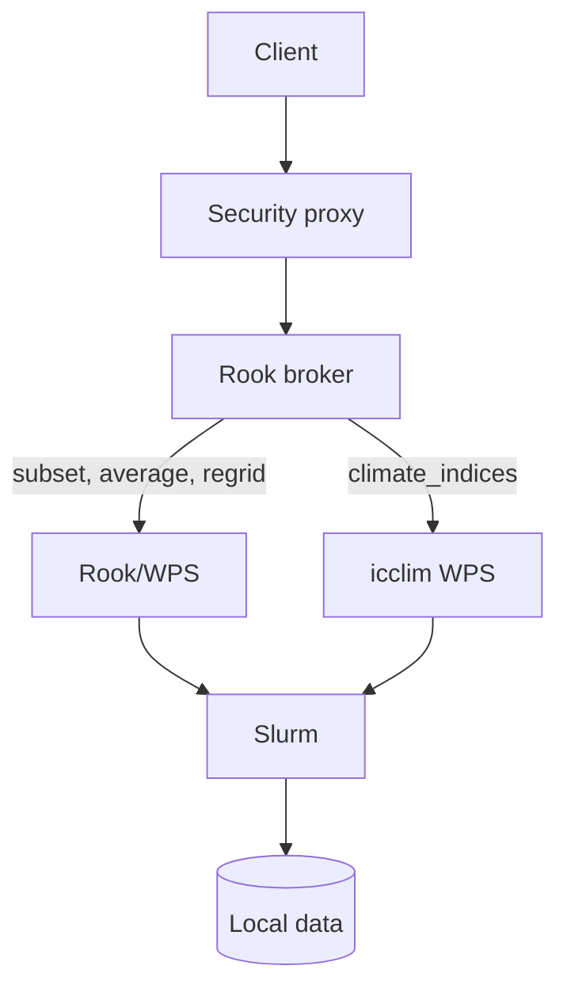

**One broker provides access to independently deployed services.**

<!-- The broker returns the selected service's accepted-job response and status
URL. It does not mirror the delegated job. -->

---

# B3. Chaining independent services

- Submit `subset` to the broker; it delegates the job to Rook.
- Use the subset output URL as input for `climate_indices`.
- The broker prefers an icclim service at the site holding the **intermediate result**.
- At the same site, a trusted URL can resolve to a **shared filesystem path**.
- Otherwise, the icclim service consumes the result through **HTTP**.
- The **client coordinates both jobs** initially.

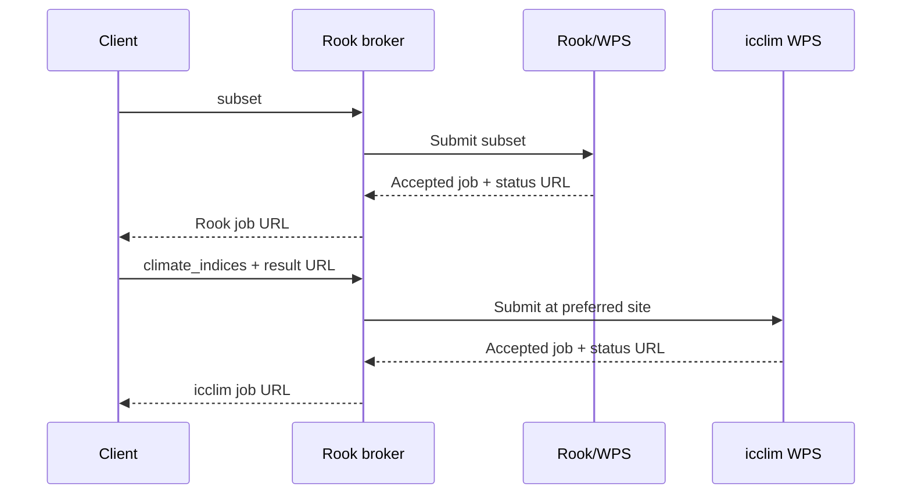

**The broker selects each service and preserves data locality when possible.**

<!-- Later, a workflow coordinator or an extended orchestrate process could
manage both jobs and expose one composite status URL. The simple broker remains
a delegation layer. -->
