# Rook/WPS for ESGF-NG

## Smart access to climate data

[](https://commons.wikimedia.org/wiki/File:Rook-Corvus_frugilegus.jpg)

**Rook — Remote Operations On Klimadaten**

*Like the bird: surveys vast archives, finds what matters, and brings it within easy reach.*

**Presented by Ag Stephens (CEDA/STFC)**

Contributors: Carsten Ehbrecht and Martin Schupfner (DKRZ), Guillaume Levavasseur (IPSL), and colleagues at Ouranos (Canada) and across the community.

Milano, September 2026

*Photo: Andreas Trepte, [Wikimedia Commons](https://commons.wikimedia.org/wiki/File:Rook-Corvus_frugilegus.jpg), [CC BY-SA 2.5](https://creativecommons.org/licenses/by-sa/2.5/).*

<!-- EDITORIAL NOTE FOR SLIDE PREPARATION

- Proposed main talk: title slide plus slides 1–10; rehearse for the allotted time.
- Optional backup material: A1 and B1–B3.
- `wf.broker()` is a proposed API sketch, not an implemented interface.
- Docker, Kubernetes and Helm are future deployment options, not operational today.
- Horizontal rules separate slides; other HTML comments are presenter notes.
-->

---

# 1. What is Rook?

- [**Rook**](https://github.com/roocs/rook) is the roocs remote processing service.
- A typical **subset request** specifies a **dataset, time range and bounding box**.
- Rook processes **close to the data** and returns the **requested subset**.

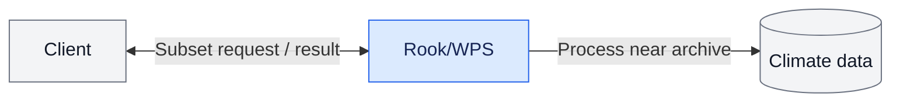

[**clisops**](https://github.com/roocs/clisops) provides the data operations; [**Woodpecker**](https://github.com/roocs/woodpecker) applies known dataset fixes.

**Move the processing to the data.**

<!-- 1:00. Rook connects climate-data clients with Python processing based on
xarray and clisops. It complements file download: users can still retrieve
complete files when that is what they need. Avoid implying complete CMIP7
coverage today. -->

---

# 2. Processing capabilities

## Data operations

- **Subset** — select space, time and levels.
- **Average** — reduce data for analysis.
- **Regrid** — transform to a target grid.

## Workflow orchestration

- **`orchestrate`** — combine operators in a **workflow**.

## Supporting processes

- **`health`** — check site health; useful for the planned broker.
- **`status`** — report operational status.

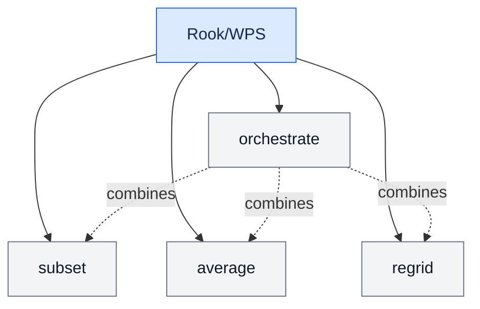

**Easy to extend with new data or supporting processes.**

<!-- 1:30. Rook exposes a separate process for each data operator. The additional
orchestrate process combines one or more operators into a workflow. The same
process mechanism supports health and status, and the planned broker.
Health is a lightweight synchronous check that also verifies configured data
files are readable. Status reports service, process, server and storage status,
not individual job status.

clisops provides the main data operations. Woodpecker prepares data by applying
maintained fixes through its core and independent plugins; keep its internal
architecture for the separate Woodpecker talk. -->

---

# 3. Rook in the Copernicus CDS today

- CDS sends a **workflow** to Rook's **`orchestrate` process**.
- A workflow uses **one or more operators** — for example, to **subset a dataset by time and area**.
- **DKRZ and IPSL:** identical Rook services and equivalent processing.
- **Replicated holdings:** CMIP6, CORDEX and other supported datasets.

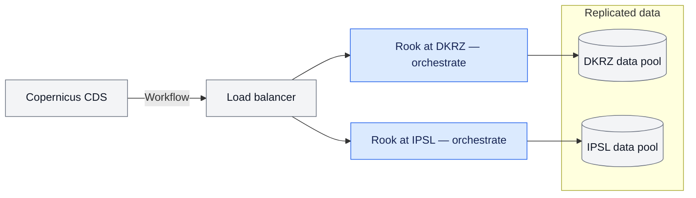

**CDS: choose any available Rook.**

<!-- 1:15. CDS submits a workflow through the load balancer. The selected Rook
site's orchestrate process executes its operations against that site's data.
This is the existing model for supported CDS datasets. Equivalent
holdings make both sites interchangeable. ESGF-NG needs smarter routing because
participating sites will not necessarily hold the same datasets. -->

---

# 4. Broker: one more Rook process

- Add a **`broker` process** to the existing Rook service.
- Use **STAC and a local PostgreSQL index** to find sites holding the dataset.
- Forward the **unchanged workflow** to the selected site's **`orchestrate` process**.

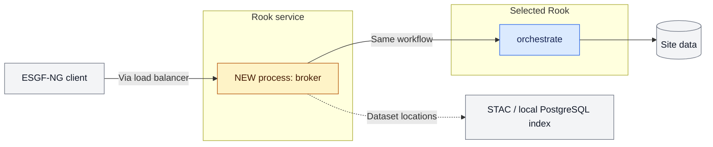

**One more Rook process, no separate broker service.**

[Broker architecture](https://github.com/roocs/rook/blob/main/ARCH_ESGF2.md)

<!-- 2:00. Planned architecture. ESGF-NG sites hold different, independently
managed datasets. The broker is a small additional process within the existing
Rook service, not a separately deployed routing component. It uses the local
PostgreSQL index for fast lookup and STAC for missing or stale information.
Kafka publication, update and deletion events
keep the local PostgreSQL index current through a Piddiplatsch plugin. The index
contains global dataset placement and detailed local assets. Global STAC is the
authoritative fallback when local information is missing or stale. Kafka and
STAC are not part of the normal synchronous request path.

The broker does not change or execute the workflow. It forwards the same
workflow to the selected Rook site's `orchestrate` process and passes the
accepted-job response and status URL back to the client. It does not mirror
remote job state and must not create broker-to-broker loops. -->

---

# 5. How the broker finds the data

- **Local Rook STAC index (PostgreSQL):** fast dataset-to-site lookup.
- [**Piddiplatsch**](https://github.com/ESGF/piddiplatsch) reads **STAC items from the ESGF-NG Kafka queue**; built for **PID publication**.
- **Mapping plugins** transform items into a target schema.
- A **new Rook plugin** can populate and update the local index.
- **Global STAC:** fallback for missing or stale information.

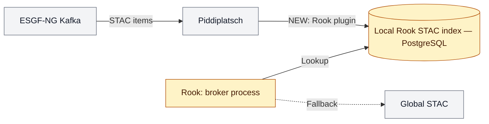

**Index updates happen independently of workflow requests.**

<!-- The local index contains global dataset placement and detailed local
assets. Piddiplatsch was built for PID publication. It consumes STAC items from
the ESGF-NG Kafka queue and uses plugins to map them to target schemas. A new
Rook plugin can use publication, update and deletion events to maintain the
local PostgreSQL-backed STAC index. STAC is the authoritative fallback; it is queried only
when local placement information is insufficient. -->

---

# 6. A workflow with Rooki

**Subset a logical dataset by time.**

```python
from rooki import operators as ops

wf = ops.Subset(
    ops.Input(
        "tas",
        [
            "c3s-cmip6.ScenarioMIP.INM.INM-CM5-0.ssp245."
            "r1i1p1f1.day.tas.gr1.v20190619"
        ],
    ),
    time="2016/2020",
    time_components="month:jan,feb,mar|day:01",
)
```

The workflow describes **what to compute**.

<!-- This example comes from the existing notebook. The dataset identifier is
logical; clients do not need to specify archive file paths. Verify availability
and the endpoint before presenting, and prepare a completed result. -->

---

# 7. Same workflow, different submission

## Today: choose a Rook service

```python
resp = wf.orchestrate()
resp.ok
```

## Proposed: let the broker choose the site

```python
resp = wf.broker()  # proposed API, not implemented
resp.ok
```

**The broker chooses WHERE; orchestrate handles HOW.**

<!-- 2:00. The workflow construction and wf.orchestrate() call come from the
existing notebook. Verify the endpoint and dataset before the talk and prepare
the completed result as a fallback.

wf.broker() is deliberately labelled as a proposed API sketch; its exact
Python signature is not implemented or fixed yet. Both calls serialize the
same workflow document. Orchestrate executes it at the service selected by the
client. Broker inspects it to resolve the dataset location, forwards it
unchanged to the selected Rook site, and returns that site's job-status URL. -->

---

# 8. Deployment today and tomorrow

| Operational today | Planned |
| --- | --- |
| Ansible-managed VMs | Portable Rook container image |
| Slurm processing jobs | Docker / Compose or Kubernetes / Helm |
| Processing near site data | Site chooses its deployment and scheduler |

**The Rook API and processing model stay the same.**

<!-- 1:00. The Ansible/VM/Slurm path is operational today. The container image,
Docker, Kubernetes and a possible Helm chart are future ESGF-NG work. They should
not require a different client API or processing implementation. A site may
keep Slurm or choose a container-native scheduler. -->

---

# 9. Discovery and access

- **STAC** advertises a processing endpoint.
- **MetaGrid or another client** discovers it and sends a bearer token.
- An **OAuth2 proxy** protects access; use [**Twitcher**](https://github.com/bird-house/twitcher) for the demo.

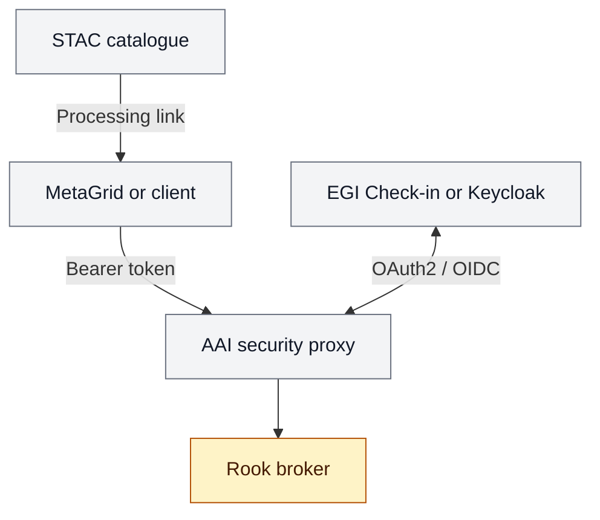

**Next: demonstrate the integration and validate CMIP7 workflows.**

<!-- 1:45. Rook's integration boundary is the processing API and optional STAC
information. Portal integration belongs to MetaGrid or its successor. A small
processing indicator or service link is sufficient and can be added later via
an ESGF-NG Kafka update; do not propose an exact STAC schema in this talk.

Twitcher is an existing, maintained component and is used by Ouranos in Canada.
It supports an immediate ESGF-NG demonstration. ESGF-NG may later rewrite or
replace the security proxy according to its final user-to-service and
service-to-service delegation requirements. Keep the WPS API independent of
the selected proxy implementation. -->

<!-- Preparation references:

- Detailed broker architecture: https://github.com/roocs/rook/blob/main/ARCH_ESGF2.md
- Process catalogue: docs/source/processes.rst
- Woodpecker configuration: docs/source/configuration.rst
- Twitcher: https://github.com/bird-house/twitcher/blob/master/README.rst
-->

---

# 10. Summary: today and tomorrow

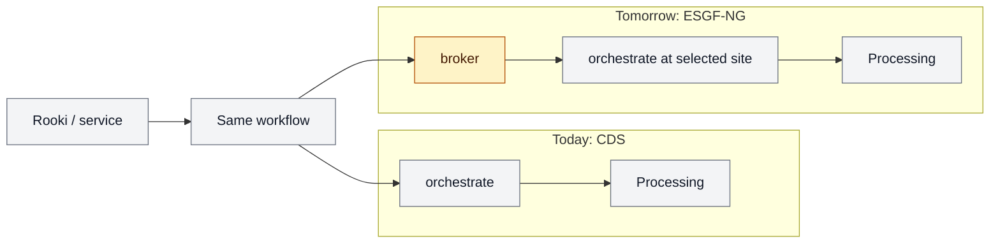

- **CDS:** choose any equivalent Rook.
- **ESGF-NG:** choose the Rook that has the data.

**`broker` decides WHERE — `orchestrate` decides HOW.**

<!-- 0:30. This is the closing picture. The ESGF-NG extension adds data-aware
site selection without changing the workflow or the processing operations. -->

---

# A1. AAI for the ESGF-NG Compute Node

## Existing components support an immediate demonstration

- Users sign in through **EGI Check-in or Keycloak**.
- Supported identities can include institutional accounts, **GitHub, Google, and ORCID**.
- MetaGrid and Rooki send an OAuth2 **bearer token** with each request.
- **Twitcher** validates the token, authorizes access, and protects the WPS endpoint.
- Twitcher is maintained and currently used by **Ouranos in Canada**.
- ESGF-NG can use **Twitcher for a demonstration** while designing a future security proxy.
- The **processing API remains independent** of the proxy implementation.

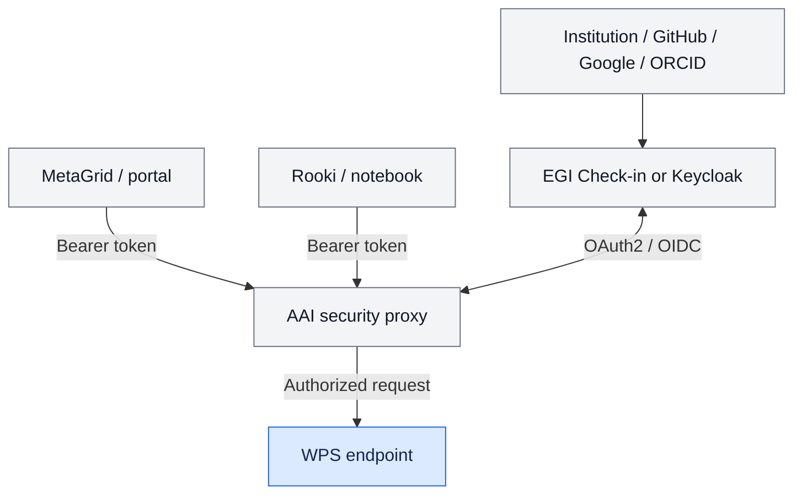

**Use Twitcher now; keep the proxy replaceable for the final ESGF-NG architecture.**

---

# B1. Option 1 — icclim as a Rook plugin

- A separate Rook plugin exposes [**icclim**](https://github.com/cerfacs-globc/icclim).
- **Python entry points** register one generic `climate_indices` process.
- Sites choose either **core** or **core + icclim** requirements.
- All processes run in the **same conda environment**.

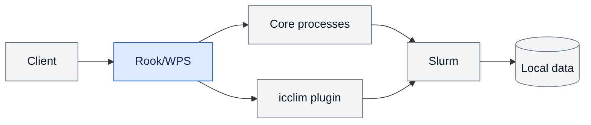

**Simple integration, provided the dependencies remain compatible.**

---

# B2. Option 2 — Separate icclim WPS

- Rook and icclim use **independent conda environments**.
- Both services run **next to the data** and use the **local Slurm cluster**.
- The **Rook broker** selects the service providing the requested process.
- Its inventory contains **dataset locations** and **available processing capabilities**.
- Existing Ansible support for **multiple WPS instances** can be reused.

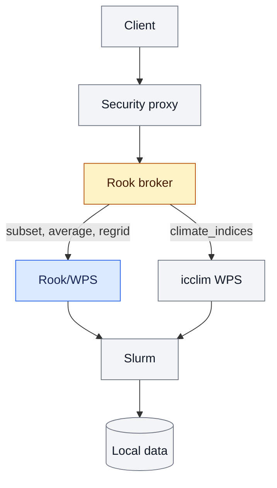

**One broker provides access to independently deployed services.**

<!-- The broker returns the selected service's accepted-job response and status
URL. It does not mirror the delegated job. -->

---

# B3. Chaining independent services

- Submit `subset` to the broker; it delegates the job to Rook.
- Use the subset output URL as input for `climate_indices`.
- The broker prefers an icclim service at the site holding the **intermediate result**.
- At the same site, a trusted URL can resolve to a **shared filesystem path**.
- Otherwise, the icclim service consumes the result through **HTTP**.
- The **client coordinates both jobs** initially.

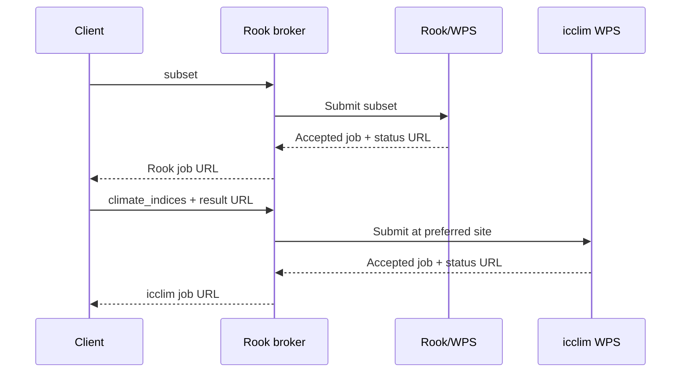

**The broker selects each service and preserves data locality when possible.**

<!-- Later, a workflow coordinator or an extended orchestrate process could
manage both jobs and expose one composite status URL. The simple broker remains
a delegation layer. -->
