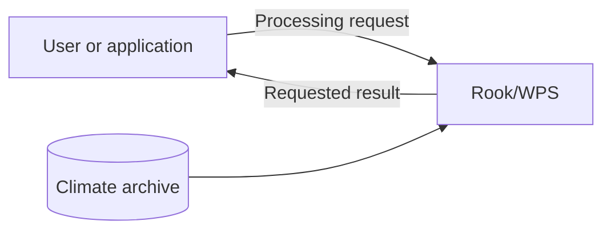
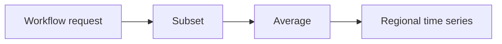
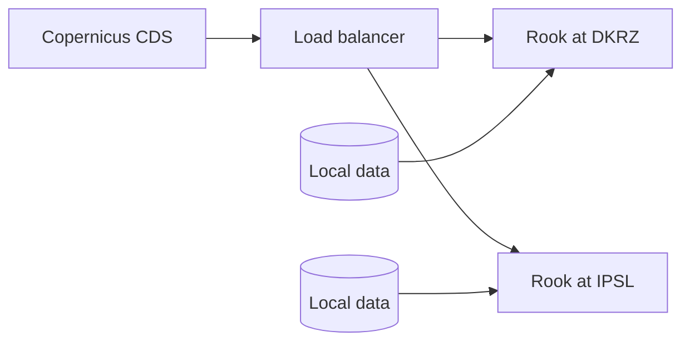
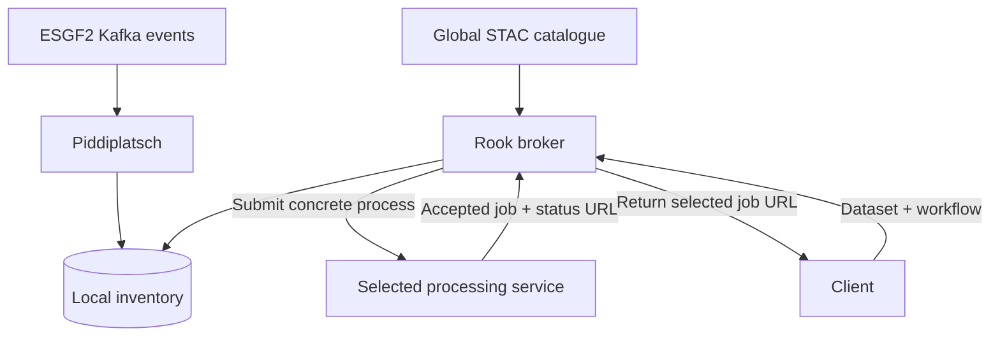
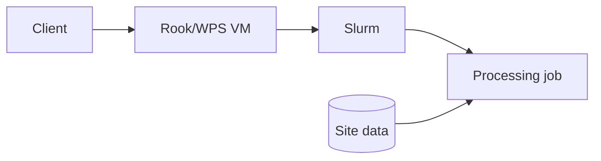
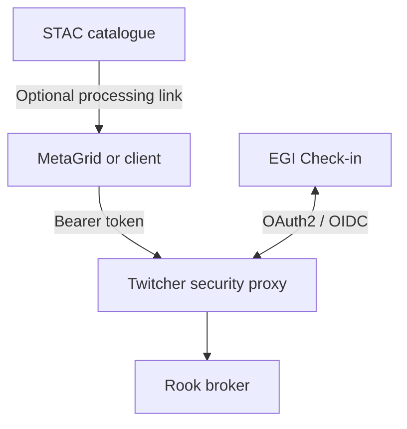
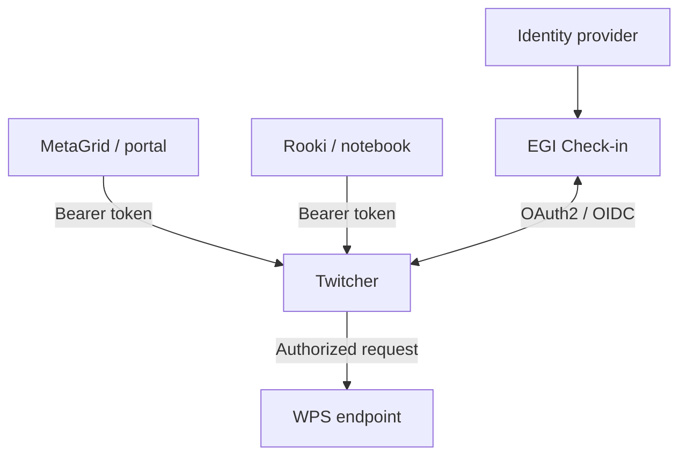
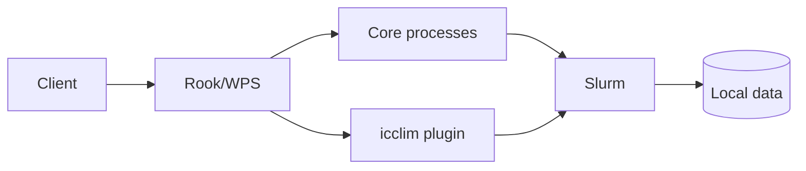
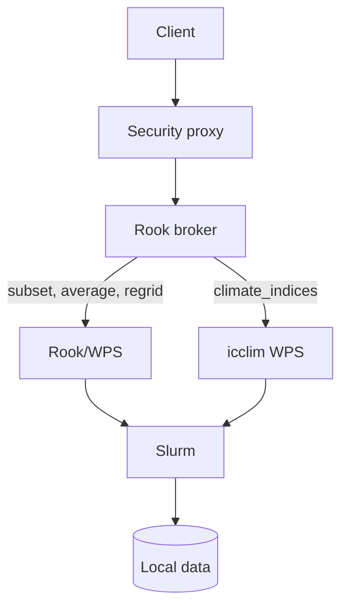
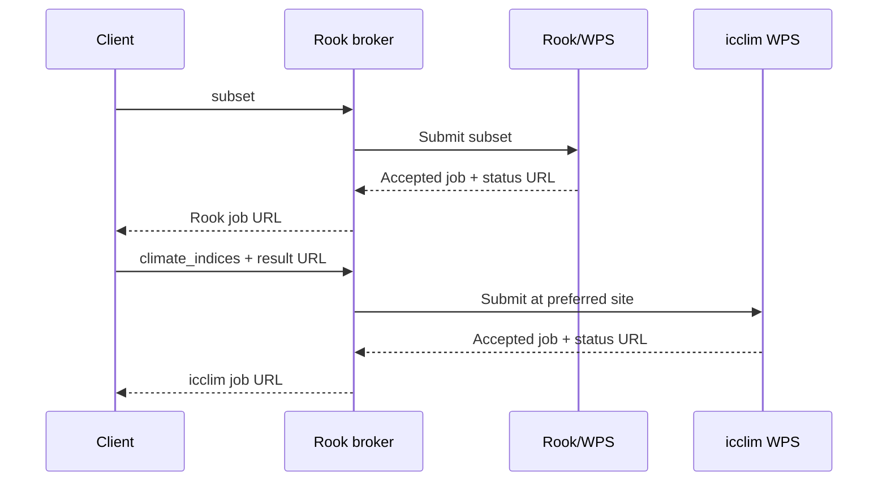

# Rook/WPS for ESGF2

Processing climate data close to the archive

## Talk outline — 10 minutes

| Slide | Topic | Time |
| --- | --- | ---: |
| 1 | Why provide a Compute Node? | 1:00 |
| 2 | Processing capabilities | 1:00 |
| 3 | Rook in the Copernicus CDS today | 1:15 |
| 4 | Planned ESGF2 broker | 2:00 |
| 5 | Notebook: today and proposed broker | 2:00 |
| 6 | Deployment today | 1:00 |
| 7 | Discovery, AAI and next steps | 1:45 |

The horizontal rules separate slides. HTML comments contain presenter notes.
The AAI and icclim slides after the main talk are backup and discussion material.

---

# 1. Why provide a Compute Node?

**Example: How does regional mean temperature change over time?**

- Select only the region and period needed.
- Process the data close to the archive.
- Retrieve the small, usable result.
- Integrate processing into scientific workflows and applications.



<!-- 1:00. A Compute Node is an additional access route for ESGF users. It
complements file download: users can still retrieve complete files when that is
what they need. Avoid implying complete CMIP7 coverage today. -->

---

# 2. Processing capabilities

- **Subset:** select space, time and levels.
- **Average:** reduce data for an analysis.
- **Regrid:** transform data to a target grid.
- **Orchestrate:** combine operations in one workflow.
- **Woodpecker:** apply known fixes through a common plugin interface.



**Woodpecker prepares the data. Rook operates on it.**

<!-- 1:00. Rook exposes the processing API; clisops provides the main data
operations. Woodpecker discovers and applies maintained dataset fixes through
its core and independent plugins. Keep its internal architecture for the
separate Woodpecker talk. -->

---

# 3. Rook in the Copernicus CDS today

**Operational today**

- CDS submits workflows to Rook.
- DKRZ and IPSL provide equivalent data and processing.
- A load balancer distributes requests between the sites.
- Each site processes its local data.



<!-- 1:15. This is the existing model for supported CDS datasets. Equivalent
holdings make both sites interchangeable. ESGF2 needs smarter routing because
participating sites will not necessarily hold the same datasets. -->

---

# 4. Planned ESGF2 broker

**Route processing to a site that holds the requested dataset**

- Add a `broker` process to Rook.
- Accept the same workflow document used by `orchestrate`.
- Resolve dataset placement and available processing services.
- Submit the concrete processing job asynchronously.
- Return the selected service's job-status URL directly.



**The client describes the workflow. The broker selects the data and service.**

<!-- 2:00. Planned architecture. Kafka publication, update and deletion events
keep a local PostgreSQL inventory current through a Piddiplatsch plugin. The
global STAC catalogue describes cross-site dataset availability. Kafka is not
part of the synchronous request path. The selected service may run a single
process or an orchestrated workflow. The broker passes the accepted-job
response and status URL back to the client. It does not mirror remote job state
and must not create broker-to-broker loops. -->

---

# 5. Notebook: today and proposed broker

**Current implementation — executable with Rooki**

```python
from rooki.client import Rooki

rook = Rooki("https://rook.dkrz.de/wps", mode="async")

response = rook.subset(
    collection=(
        "c3s-cmip6.CMIP.IPSL.IPSL-CM6A-LR.historical."
        "r1i1p1f1.Amon.rlds.gr.v20180803"
    ),
    time="1985-01-01/2014-12-30",
    area="-10,35,30,70",
)

response.ok
response.download_urls()
dataset = response.datasets()[0]
```

**Proposed ESGF2 broker — same user intent, automatic site selection**

```python
workflow = {
    "process": "subset",
    "inputs": {
        "collection": "<same-dataset-id>",
        "time": "1985-01-01/2014-12-30",
        "area": "-10,35,30,70",
    },
}

job = rook.broker(workflow=workflow)  # proposed API
job.status_url
```

**Today the client selects the service. The broker will select the site.**

<!-- 2:00. Run only the first example. It uses the dataset from the documented
Rooki example; verify the endpoint and dataset before the talk and prepare the
completed result as a fallback. response.download_urls() and response.datasets() are part
of the current Rooki interface. The broker call is deliberately labelled as a
proposed API sketch. Its exact Python signature is not implemented or fixed yet.
For a multi-step subset/average example, pass an orchestrate-style workflow
document instead; the architectural point remains the same. -->

---

# 6. Deployment today

**Current operational deployment**

- **Ansible** provisions Rook/WPS on **VMs**.
- **Slurm** schedules processing jobs.
- Jobs access data available at the site.
- The same model can be deployed at further ESGF2 sites.



<!-- 1:00. Describe only the current deployment. Docker, Kubernetes and Helm
are an alternative deployment path to prepare during ESGF2, not the present
production architecture. -->

---

# 7. Discovery, AAI and next steps

- **STAC:** optionally advertise processing with a small flag or service link.
- **Portal:** MetaGrid or another client discovers the endpoint through STAC.
- **AAI proxy:** protect Rook and support OAuth2 identity delegation.
- **Demo:** use the existing and maintained Twitcher security proxy.
- **Later:** review or rewrite the proxy for the final ESGF2 architecture.
- **Next:** validate CMIP7 workflows and prepare a container deployment.



**STAC provides discovery. AAI protects access. Rook provides processing.**

<!-- 1:45. Rook's integration boundary is the processing API and optional STAC
information. Portal integration belongs to MetaGrid or its successor. A small
processing indicator or service link is sufficient and can be added later via
an ESGF2 Kafka update; do not propose an exact STAC schema in this talk.

Twitcher is an existing, maintained component and is used by Ouranos in Canada.
It supports an immediate ESGF2 demonstration. ESGF2 may later rewrite or
replace the security proxy according to its final user-to-service and
service-to-service delegation requirements. Keep the WPS API independent of
the selected proxy implementation. -->

<!-- Preparation references:

- Local broker/CDS design: ARCH_ESGF2.md
- Process catalogue: docs/source/processes.rst
- Woodpecker configuration: docs/source/configuration.rst
- Twitcher: https://github.com/bird-house/twitcher/blob/master/README.rst
-->

---

# A1. AAI for the ESGF2 Compute Node

## Existing components support an immediate demonstration

- Users sign in through **EGI Check-in**.
- MetaGrid and Rooki send an OAuth2 **bearer token** with each request.
- **Twitcher** validates the token, authorizes access, and protects the WPS endpoint.
- Twitcher is maintained and currently used by **Ouranos in Canada**.
- ESGF2 can use Twitcher for a demonstration while designing a future security proxy.
- The processing API remains independent of the proxy implementation.



**Use Twitcher now; keep the proxy replaceable for the final ESGF2 architecture.**

---

# B1. Option 1 — icclim as a Rook plugin

- `rook-icclim` is maintained in a separate repository.
- Python entry points register one generic `climate_indices` process.
- Sites choose either **core** or **core + icclim** requirements.
- All processes run in the same conda environment.



**Simple integration, provided the dependencies remain compatible.**

---

# B2. Option 2 — Separate icclim WPS

- Rook and icclim use independent conda environments.
- Both services run next to the data and use the local Slurm cluster.
- The **Rook broker** selects the service providing the requested process.
- Its inventory contains dataset locations and available processing capabilities.
- Existing Ansible support for multiple WPS instances can be reused.



**One broker provides access to independently deployed services.**

<!-- The broker returns the selected service's accepted-job response and status
URL. It does not mirror the delegated job. -->

---

# B3. Chaining independent services

- Submit `subset` to the broker; it delegates the job to Rook.
- Use the subset output URL as input for `climate_indices`.
- The broker prefers an icclim service at the site holding the intermediate result.
- At the same site, a trusted URL can resolve to a shared filesystem path.
- Otherwise, the icclim service consumes the result through HTTP.
- The client coordinates both jobs initially.



**The broker selects each service and preserves data locality when possible.**

<!-- Later, a workflow coordinator or an extended orchestrate process could
manage both jobs and expose one composite status URL. The simple broker remains
a delegation layer. -->
