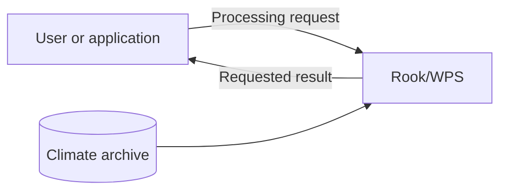
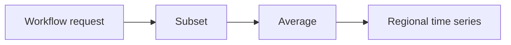
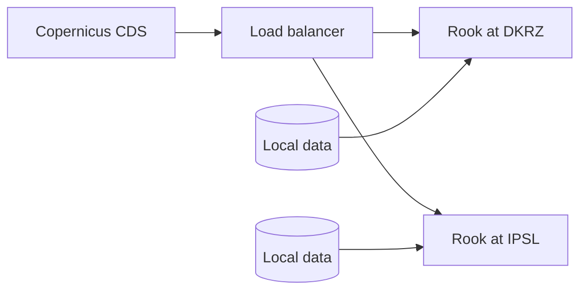
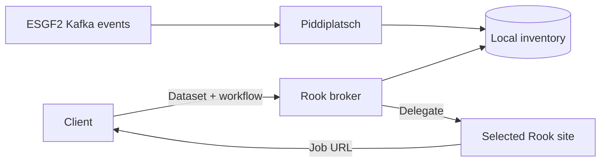
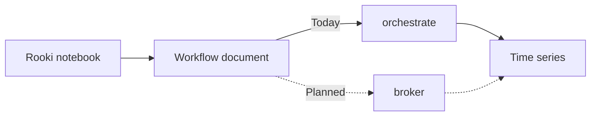
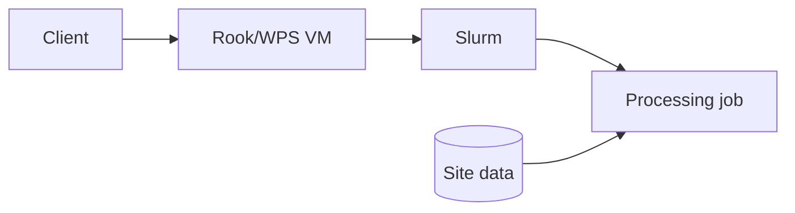
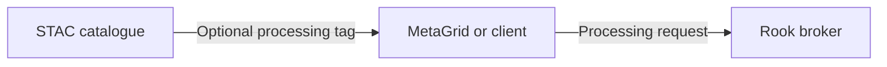

# Rook/WPS for ESGF2

Processing climate data close to the archive

## Talk outline — 10 minutes

| Slide | Topic | Time |
| --- | --- | ---: |
| 1 | Why provide a Compute Node? | 1:00 |
| 2 | Processing capabilities | 1:00 |
| 3 | Rook in the Copernicus CDS today | 1:15 |
| 4 | Planned ESGF2 broker | 2:00 |
| 5 | One workflow: notebook demonstration | 2:00 |
| 6 | Deployment today | 1:00 |
| 7 | Discovery, AAI and next steps | 1:45 |

The horizontal rules separate slides. HTML comments contain presenter notes.

---

## 1. Why provide a Compute Node?

**Example: How does regional mean temperature change over time?**

- Select only the region and period needed.
- Process the data close to the archive.
- Retrieve the small, usable result.
- Integrate processing into scientific workflows and applications.

<!-- 1:00. A Compute Node is an additional access route for ESGF users. It
complements file download: users can still retrieve complete files when that is
what they need. Avoid implying complete CMIP7 coverage today. -->

---

## 2. Processing capabilities

- **Subset:** select space, time and levels.
- **Average:** reduce data for an analysis.
- **Regrid:** transform data to a target grid.
- **Orchestrate:** combine operations in one workflow.
- **Woodpecker:** apply known fixes to datasets with compliance issues.

<!-- 1:00. Rook exposes the processing API; clisops provides the main data
operations. Mention Woodpecker by name and purpose so that people recognize it.
Do not explain its internal architecture. -->

---

## 3. Rook in the Copernicus CDS today

**Operational today**

- CDS submits workflows to Rook.
- DKRZ and IPSL provide equivalent data and processing.
- A load balancer distributes requests between the sites.
- Each site processes its local data.

<!-- 1:15. This is the existing model for supported CDS datasets. Equivalent
holdings make both sites interchangeable. ESGF2 needs smarter routing because
participating sites will not necessarily hold the same datasets. -->

---

## 4. Planned ESGF2 broker

**Route processing to a site that holds the requested dataset**

- Add a `broker` process to Rook.
- Accept the same workflow document used by `orchestrate`.
- Select a site using dataset placement and service availability.
- Submit the processing job asynchronously.
- Return the selected site's job-status URL directly.

<!-- 2:00. Planned architecture. Kafka publication, update and deletion events
keep a local PostgreSQL inventory current through a Piddiplatsch plugin. Kafka
is not part of the synchronous request path. The selected site may run a single
process or an orchestrated workflow. The broker is only a delegation layer: it
does not mirror remote job state and must not create broker-to-broker loops. -->

---

## 5. One workflow: notebook demonstration

**Regional mean temperature over a selected period**

- Select a dataset, region and time range.
- Build a **subset → average** workflow with Rooki.
- Submit and follow the job.
- Retrieve and plot the regional time series.

**The workflow stays the same; the broker adds site selection.**

<!-- 2:00. Demonstrate the existing direct orchestrate path with one verified
dataset. Explain that the planned broker will accept the same workflow document.
Do not imply that the notebook already runs through the broker. Have a completed
notebook and plot ready as a fallback. -->

---

## 6. Deployment today

**Current operational deployment**

- **Ansible** provisions Rook/WPS on **VMs**.
- **Slurm** schedules processing jobs.
- Jobs access data available at the site.
- The same model can be deployed at further ESGF2 sites.

<!-- 1:00. Describe only the current deployment. Docker, Kubernetes and Helm
are an alternative deployment path to prepare during ESGF2, not the present
production architecture. -->

---

## 7. Discovery, AAI and next steps

- **STAC:** optionally advertise processing with a small flag or service link.
- **Discovery:** MetaGrid or another portal can find this information in STAC.
- **AAI:** update earlier OAuth2/Keycloak proxy solutions for ESGF2.
- **CMIP7:** validate representative datasets and workflows.
- **Deployment:** prepare Docker/Kubernetes/Helm as an alternative.

**Rook provides processing. STAC makes it discoverable. The portal decides how to expose it.**

<!-- 1:45. Rook's integration boundary is the processing API and optional STAC
information. Portal integration belongs to MetaGrid or its successor. A small
processing indicator or service link is sufficient and can be added later via
an ESGF2 Kafka update; do not propose an exact STAC schema in this talk.

AAI does not start from scratch. Earlier deployments used an AAI proxy with
OAuth2 delegation to Keycloak. CEDA developed an Nginx/Python proxy. Twitcher
offers more OGC-aware functionality, including service registration, OAuth2 and
certificate support, and is actively used by Ouranos in Canada. For ESGF2, the
components and the required user-to-service and service-to-service delegation
patterns need to be reviewed. Do not imply that a proxy has already been
selected. -->

<!-- Preparation references:

- Local broker/CDS design: ARCH_ESGF2.md
- Process catalogue: docs/source/processes.rst
- Woodpecker configuration: docs/source/configuration.rst
- Twitcher: https://github.com/bird-house/twitcher/blob/master/README.rst
-->
