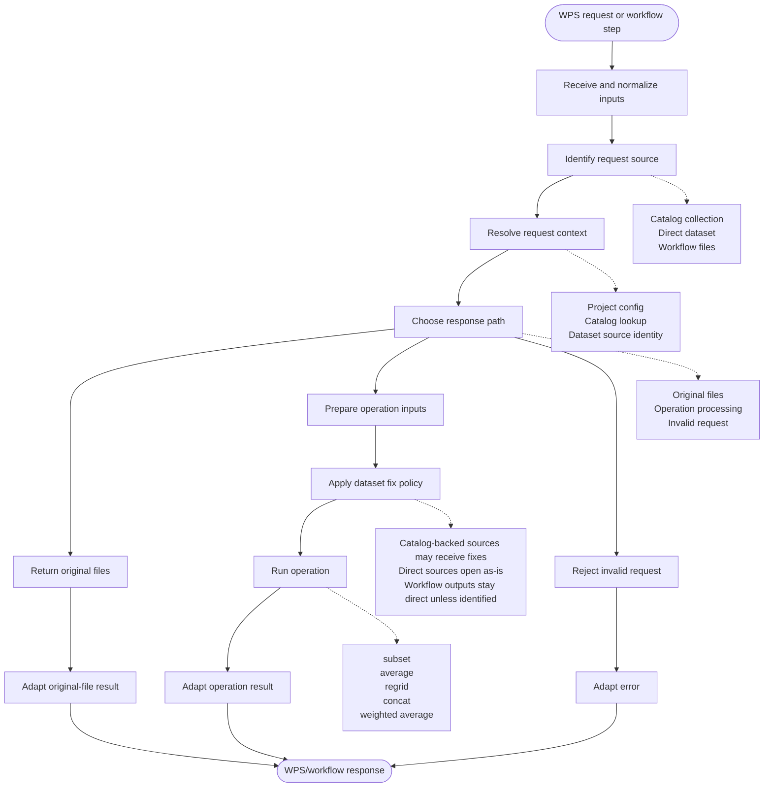

# Rook Cleanup TODO

This document tracks the cleanup phase after the `v1.2.2` release.

The previous phase made the request decision model more explicit: request
sources, request decisions, operation execution, workflow file inputs, and the
dataset-processing diagram are now much easier to see. The code is better, but
the vocabulary still carries old names and mental models.

The minimum goal for this phase is to clean up the vocabulary. In particular,
remove the old "director" naming from code and documentation and replace it
with names that describe what the code actually does. Also avoid calling the
current decision value a "plan": it is not an ordered plan, it is a request
decision.

Keep the work in small, reviewable pull requests. Preserve WPS behavior unless
a change is explicit, documented, and covered by tests.

## Phase Goals

- retire the `director` namespace and old director terminology;
- retire misleading "plan" terminology where the code only returns one request
  decision;
- make the main processing phases obvious in code and docs before exposing
  detailed branch rules;
- use consistent names for request decisions, processing decisions, operation
  execution, workflow file inputs, and WPS response adaptation;
- make module names, class names, function names, tests, and docs tell the same
  story;
- keep the current request-decision behavior stable while renaming and
  simplifying;
- remove compatibility shims only when imports can be updated clearly;
- keep dataset/project fixes explicit enough that they can later move to
  Woodpecker without another vocabulary cleanup.

## Vocabulary To Clarify

These names should become boring and predictable:

- request source: catalog collection, direct dataset, workflow files;
- request decision/resolution: classifies a request and returns one decision;
- processing decision: return original files, run an operation, or fail;
- operation runner: adapts request decisions to clisops/Rook operation calls;
- response adapter: translates internal results and errors to WPS responses;
- workflow execution: passes previous step outputs as workflow files;
- dataset fix policy: decides when source identity allows project-specific
  fixes.

Avoid names that imply hidden authority or broad orchestration when the code is
really only deciding, adapting, or running one operation.

## Readability Shape

The decision tree may stay complex because the behavior is genuinely complex.
The code should still make the main phases easy to recognize:

- receive and normalize request inputs;
- identify the request source;
- resolve catalog metadata when needed;
- decide whether to return existing files or run processing;
- prepare operation inputs;
- run the operation or collect original-file URLs;
- adapt results and errors for WPS.

Detailed rules should sit behind named predicates or small context-specific
objects. Use abstract classes only where they make the common shape clearer;
avoid creating an inheritance layer just to hide branch-specific behavior.

The docs should mirror this split with two diagrams:

- a high-level diagram that shows the main processing phases;
- a detailed diagram that shows the decision rules and branch points.

The high-level diagram can use this shape as a guide:



## Guiding Module Layout

Use `rook.pflow` for the processing-flow layer. The package name is short, but
the package documentation should spell it out once: `pflow` means processing
flow.

The first target shape can look like this:

```text
rook/
  pflow/
    __init__.py
    base.py
    sources.py
    decisions.py
    resolver.py
    execution.py
    policies.py
    catalog.py
    alignment.py
    results.py
```

`base.py` should collect the abstract shape of the layer:

- `RequestSource`: normalized source for a request;
- `RequestDecision`: one decision about how a request should be handled;
- `RequestResolver`: turns raw request inputs into one request decision;
- `DecisionExecutor`: executes one request decision;
- `RequestPolicy`: optional base for small context-specific policies.

Keep inheritance shallow. The abstract classes should make the main processing
flow visible; concrete modules should keep branch-specific behavior explicit.

Concrete modules can then own the current behavior:

- `sources.py`: `CatalogCollection`, `DirectDataset`, `WorkflowFiles`,
  source classification;
- `decisions.py`: `ReturnOriginalFiles`, `RunOperation`, `InvalidRequest`;
- `resolver.py`: high-level request decision flow;
- `execution.py`: original-file collection, operation-input preparation, and
  operation runner calls;
- `policies.py`: original-file policy, processing-required policy, dataset-fix
  policy hooks;
- `catalog.py`: catalog lookup, validation, and dataset-source preparation;
- `alignment.py`: subset-to-file alignment checks;
- `results.py`: `RequestResult` and response-facing result values.

## Suggested Pull Request Order

1. Choose the replacement vocabulary and document it in this TODO and the
   processing diagram notes.
2. Sketch the desired code shape for the main processing phases before moving
   files.
3. Rename the `rook.director` namespace to `rook.pflow` without changing
   behavior.
4. Update imports in WPS processes, operation execution, workflow code, tests,
   and docs.
5. Rename public/internal classes and functions that still use director-era
   words.
6. Simplify compatibility shims left behind by the rename.
7. Refresh the Mermaid processing diagram and architecture docs with the new
   names.
8. Run the focused request-decision/workflow/operation tests, then the default
   non-smoke suite and smoke tests before release.

## Phase Checklist

Use this as the running progress log for the phase. Tick a box only after the
corresponding PR has landed.

- [x] Replacement vocabulary is agreed and written down.
- [x] `rook.pflow` module layout is introduced with `base.py` abstractions.
- [x] Misleading "plan" terminology is replaced with decision/resolution
  terminology.
- [x] Main processing phases are recognizable in code.
- [x] `rook.director` namespace is renamed.
- [x] WPS process imports use the new request-decision vocabulary.
- [x] Operation execution imports use the new request-decision vocabulary.
- [x] Workflow execution imports use the new request-decision vocabulary.
- [x] Tests no longer use director-era names.
- [x] Remaining compatibility shims are removed or explicitly justified.
- [x] Processing diagrams and architecture docs use the new names.
- [x] Documentation has a high-level processing phase diagram.
- [x] Documentation has a detailed decision-rule diagram.
- [x] Changelog records the vocabulary cleanup.
- [x] Smoke tests pass after the rename.

## Guardrails

Every pull request should demonstrate that:

- code and documentation stay clean, simple, and direct;
- abstractions are added only when they make the processing flow easier to
  read;
- the WPS process interface remains compatible, including existing inputs used
  by CDS calls; avoid changing public WPS inputs unless there is an explicit
  migration plan because CDS API changes have a longer adaptation cycle;
- direct local, URL, S3, Zarr, and Kerchunk inputs still work;
- catalog-backed NetCDF processing is unchanged;
- original-file responses still contain public download URLs;
- workflow outputs can feed later workflow steps;
- dataset fixes are applied only when the source identity supports them;
- output naming, splitting, provenance, and error responses remain stable unless
  a deliberate change is documented.

For this phase and future cleanup tasks, always run project commands through the
`rook` conda environment, for example `conda run -n rook pytest ...`.

Run focused tests while iterating, followed by lint, docs, and the default
non-smoke test suite before each pull request.

## Follow-Up Notes

- Keep the immediate mini ESGF test-data fix inside Rook and leave clisops
  untouched. The current fixture should use the existing clisops/Pooch `stratus`
  helper, but the Rook-side selection of required files should be made a little
  nicer: easier to read, named by test-data purpose, and documented as a
  temporary bridge until mini-esgf-data is replaced in a later phase.
- Review the operation adapters in this phase if possible, especially `concat`.
  Concat-specific fix behavior has been clarified for the next phase, where the
  Woodpecker fixes library can take over dataset/project fixes.
- In a later cleanup phase, delegate dataset/project fixes to the Woodpecker
  library. This phase should only keep the current Rook policy explicit enough
  to make that future handoff straightforward.

## Deferred Features

These remain outside this cleanup phase:

- live S3 integration tests requiring external test data or credentials;
- writing operation output directly to S3 or Zarr;
- combining multiple Zarr stores or selecting Zarr groups through WPS inputs;
- supporting additional object-store protocols;
- replacing mini-esgf-data;
- delegating dataset/project fixes to Woodpecker;
- redesigning all Rook configuration at once.
